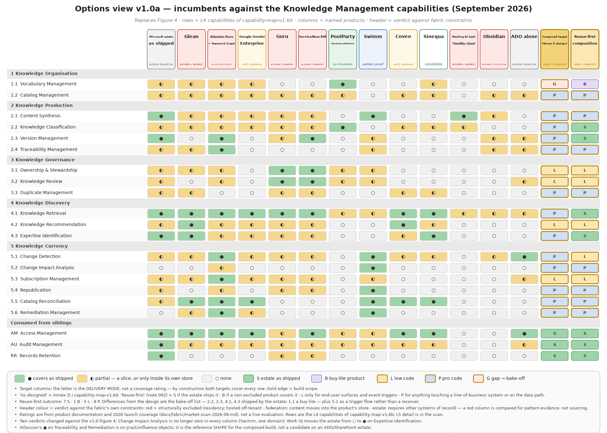

# Documentation Fabric — Business Requirements Specification (BRS)

Product Delivery Knowledge · Enterprise Architecture · Department of Health Abu Dhabi · Version 2.0 draft · September 2026

**Who this is for.** Business owners, delivery leads, records and information governance, and the people who will own or steward documentation. It states the problem, who is affected, what the organisation wants to be true afterwards, what it must be able to do, and the courses of action open to it. It deliberately contains no architecture. The Functional Requirements Specification (FRS v2.0) carries the detail for architects and builders.

**What changed since v1.0.** Version 1.0 was an initiative decision document written for architects. This version separates the business case from the technical specification, rebuilds the capability model on the standards the organisation already uses for business architecture, and records five design decisions reached during analysis (the knowledge graph's three axes, the delivery-mode rule, the ports-and-adapters boundary, the data-product structure, and the provenance ladder). Every figure is regenerated from those decisions.

## 1. The problem in one page

Delivery knowledge — the documents, decisions, drawings and meeting outcomes produced while building and running the organisation's products — is spread across SharePoint, Azure DevOps, the enterprise-architecture repository, Teams, Outlook, wikis and design boards. Three things follow.

- **It cannot be found with confidence.** Locating the current version of anything is manual work, and nothing tells a reader whether what they found is still true.
- **It goes stale silently.** Documentation is written by hand at every delivery step. When a decision, a design or a work item changes, nothing connects that change to the documents it invalidates. Published material rots without anyone being told.
- **It cannot safely feed AI.** Copilot, conversational assistants and coding agents are only as reliable as the corpus they read. Stale, duplicated and unlabelled documentation makes them confidently wrong, and an unlabelled corpus cannot be exposed to them at all under the organisation's sensitivity rules.

Code and tests are already versioned, traced and reviewed in git and Azure DevOps. The unsolved classes are the narrative ones: documents, decisions and drawings.

## 2. Stakeholders

| Role | Stake | What changes for them |
|---|---|---|
| Delivery teams (BA, EA, developers, operations) | produce the artifacts | every discipline's work becomes a work item; artifacts are linked to their work item at creation |
| Document owners | accountable for what is published | receive a one-touch review card in Teams for every draft; nothing is published without their approval |
| Knowledge stewards (new role) | curate what is trusted | work the queues: unlinked artifacts, duplicates, candidate vocabulary terms |
| Line managers | escalation | receive a review that an owner has not answered within the agreed time |
| Records and information governance | retention, sensitivity, audit | policies apply unchanged; the fabric adds a full audit trail of synthesis, approval and publication |
| Enterprise Architecture | design authority and initiative owner | owns the gates between phases and the quarterly review that retires custom components |
| Consumers of knowledge (everyone) | find and trust documentation | search that returns current, labelled, attributed material — through Copilot, Teams and search |
| AI agents acting for people | ground on specifications, decisions and runbooks | the same permission-trimmed access a person has, no more |

The same person is often producer, owner and consumer within a week. The roles are duties, not departments.

## 3. Goals and outcomes

**Goal.** Always-current, findable, de-duplicated and safely accessible documentation of the product delivery lifecycle, produced with far less manual effort.

| Outcome | How we will know | Baseline measured at inception |
|---|---|---|
| Documentation is current | staleness age of published material falls and stays low; a change in one system produces a re-draft or a notification in the documents it affects | time-to-detect a stale document |
| Documentation is findable | time-to-locate falls; answers come with the artifact's owner, status and how much to trust it | time-to-locate |
| Documentation is not duplicated | duplication rate falls; overlapping drafts are caught before review | duplication rate |
| Documentation is safe to expose | every artifact carries its sensitivity label and owner, and every consumer, human or AI, sees only what they may | share of corpus labelled |
| Effort falls | drafts are produced automatically and approved without substantive rewrite | share of drafts approved without rewrite (the synthesis pilot) |
| Trust is measurable | the share of links made automatically versus asked, and the precision of impact analysis, are published numbers | auto-association ratio; impact precision |

## 4. Guiding principles (plain language)

1. **Owners change knowledge; the system only proposes.** Drafts and suggestions are produced automatically. Nothing is published, merged or corrected without a person's action.
2. **Content stays where it lives.** Documents remain in SharePoint, work items in Azure DevOps, models in the EA repository. The fabric holds only descriptions, links and status — never the documents themselves.
3. **The source decides who may read.** Sensitivity labels and permissions are enforced by the system that owns the content, every time it is read.
4. **People and AI agents are peers.** An agent sees exactly what the person it acts for may see. There is no privileged AI path.
5. **AI suggests; it never decides.** Facts such as the owner or the sensitivity label are looked up. Judgements such as approval or merging are human. AI contributes suggestions with a confidence, and its accuracy is measured.
6. **Every artifact has its own identity; every delivery artifact carries its work item.** The Azure DevOps work item is the shared key for delivery work across all disciplines, but it is one link among several, not the only way knowledge is organised.
7. **Links are captured, never guessed.** A connection between two things exists because it was made, found in the content, or confirmed by a person. Uncertain suggestions ask, with one tap. "Not linked" is an honest, visible state.
8. **Only managed artifacts enter the lifecycle.** Transcripts, threads and working files stay where they are as pointers. What gets owned, reviewed and published are the products made from them.
9. **Complete at every phase.** Each phase is a working product on its own. Promotion to the next is decided by published measurements, not dates.
10. **Never build what the organisation already owns.** The custom core stays thin. A quarterly review retires any custom component the moment a standard platform equivalent exists.

## 5. What the organisation must be able to do

The capability model below is expressed in the organisation's business-architecture conventions (BIZBOK generics, levelled from the enterprise down). Knowledge Management is the capability this initiative uplifts; the other capabilities it touches — document and records management, identity and access, work-item management, decision and architecture management, and the roles of owner and steward — are either consumed as they exist today or changed in how they operate, and are set out in the FRS.

Knowledge Management decomposes into five groups. Each is stated below as a business requirement; the FRS carries the detail.

| ID | Business requirement | Why it matters to the business |
|---|---|---|
| BR-1 Organise | Define what things mean and how they are identified: a shared vocabulary of business concepts (capabilities, systems, products, processes) and one identity for every managed artifact | People search by what a thing is about, not by which work item produced it; without a shared vocabulary, two teams describe the same thing differently and neither finds the other's work |
| BR-2 Produce | Turn the outputs of delivery work into managed artifacts automatically: classify, draft, version, and link each one to its work item, its references and its subjects | Removes the manual authoring effort at every delivery step; makes the link between a change and the documents it affects exist at all |
| BR-3 Govern | Decide what is trusted and who is accountable: named owners and stewards, a one-touch review, duplicate control | Nothing is published without an owner's approval; duplicates are caught before they multiply |
| BR-4 Discover | Find and reuse what exists: search, recommendations before creating something new, and eventually "who knows this" | Time-to-locate falls; people reuse instead of recreate |
| BR-5 Keep current | Detect changes in the source systems, work out what they affect, re-draft or notify, republish, and reconcile the catalog with reality | The outcome nothing provides today: published material stops rotting silently |

Three further business requirements sit across all five:

| ID | Business requirement | Why it matters |
|---|---|---|
| BR-6 Safe exposure | Every artifact carries its sensitivity label and owner; every consumer, human or AI, sees only what they may, decided by the source system at the moment of reading | The precondition for using Copilot and agents on this corpus at all |
| BR-7 Trust is visible | Every answer says how the knowledge behind it earned its place: looked up, found, confirmed by a person, or suggested by AI — and only the first three may drive "what does this change break" | Executives, auditors and owners can see why the system believes something |
| BR-8 Evidence-gated delivery | Each phase ships a complete, severable product; promotion is decided on published measurements | Spend follows demonstrated value |

### 5.1 The shared vocabulary

The first business requirement, Organise, rests on something the organisation does not yet own: a shared vocabulary of the business constructs its knowledge is about — capabilities, systems, products, processes, document types — with one agreed name for each thing, the other names it goes by, how the terms relate, and who is allowed to change them. Without it, two teams describe the same thing differently and neither finds the other's work; search returns what matched a word, not what was meant; and AI has nothing to anchor a suggestion to.

In business terms the vocabulary has four parts. **Concept schemes** are the controlled lists of terms and their relationships, one per family of business construct. **The ontology** is the small set of definitions saying what an artifact, a work item, an owner and a link are, so the whole fabric speaks one language. **Alignment** relates one scheme to another without merging them — the capability map's "Claims Management" to the EA repository's claims systems, for instance. **Lifecycle** is how new terms are proposed, accepted, retired and never silently deleted.

Three decisions follow for the business. The vocabulary is **seeded, not grown from nothing**: from the capability reference model, the EA repository's systems, the Azure DevOps area paths and the confirmed document types. It is **curated by a named steward** per scheme, whose decisions are the only way a new term becomes official. And it is one of the two capabilities where a **small purchase** is worth piloting: the market for vocabulary management is mature, and the alternative is the SharePoint term store, which covers the lists but not the relationships, the alignment or the workflow.

### 5.2 How knowledge earns trust

The principle "AI suggests, it never decides" has a precise meaning in the fabric, and it is the single most important thing to understand about how the system behaves. Knowledge enters at one of six levels of trust and can be promoted by a person. What the system is allowed to do with a piece of knowledge depends on its level.

Two consequences for the business. First, the review card, the duplicate decision and the vocabulary decision are not administrative overhead: they are the only way knowledge moves up the ladder, and the fabric cannot publish without them. Second, the number of links the system can make on its own versus the number it has to ask about is a published health measure, and the operating decision to file every artifact under its work item at creation is what keeps that number high.

## 6. How it will operate

One standing pipeline runs for every delivery step. Sources emit change events; the fabric identifies and classifies the artifact, links it, works out what it affects, drafts, checks for overlap, and sends the owner a one-touch card. Approval baselines the artifact, republishes it, and notifies followers. Two human touchpoints are designed in — the owner's review and the steward's adjudication — plus a one-tap card whenever a link needs confirming.

What the business commits to, to make this work:

- **Drive delivery on Azure DevOps.** Every discipline's work — business analysis, architecture, operations, not only development — is a work item, and artifacts are filed under their item at creation. This is the single largest determinant of how much the system can link automatically.
- **Name owners and appoint stewards.** Ownership is a duty on an existing role; stewardship is a new role with a small, measured workload.
- **Confirm the document types.** Six types were assumed; the business confirms the set in one meeting, which unblocks templates, drafting and review depth.
- **Tolerate honest gaps.** "Not linked" and "not yet confirmed" are visible states. The system will not invent a link to hide a gap.

## 7. Courses of action

### 7.1 What the market offers

No product covers the need. The market was scanned in September 2026, product by product, against every capability in Figure 1. The two gold columns on the right are what the organisation would compose: as originally designed, and reuse-first.

- **The Microsoft platforms the organisation already owns** cover roughly a third of the capabilities as shipped and touch most of the rest; the gap is working out what a change breaks.
- **Enterprise AI search products** cover discovery only, and the leading one is hosted outside the region.
- **Work-graph suites** (Atlassian) have the right shape but require replacing Azure DevOps and SharePoint as systems of record.
- **Curated knowledge-base products** do governance well but require moving content into their store, which contradicts principle 2.
- **Taxonomy and ontology platforms** cover the vocabulary capability fully and are a candidate for a small purchase.
- **Documentation-as-code tools** prove that "detect what a change breaks and fix it" works, in the code domain only.

The vocabulary capability (Figure 2) was scanned separately, because it is the one place where a purchase can cover a whole capability rather than a slice.

Three things the business should take from it. The platforms already owned cover the term lists but not the relationships, the alignment between vocabularies, or the editorial workflow. Five specialist products cover the whole capability, and the ones with SharePoint integration are the shortlist. An open-source tool maintained for the EU Publications Office covers the standard itself at no licence cost, and is the baseline any paid product must beat; the decision is a pilot, not a purchase, and it is on the Gate A checklist.

### 7.2 The recommended course: compose, reuse first, build only the core

Use the platforms the organisation owns wherever they serve. Pilot one or two small purchases (document classification; vocabulary management). Build only the connective core that no vendor sells: the catalog keyed on the organisation's own work items and vocabulary, the graph of what links to what, the currency loop, and the owner gate.

The build is kept honest by a rule: **low code is used only for the screens people touch and for triggering events; anything that reads or writes a line-of-business system is engineered, tested and versioned.**

### 7.3 Phased, with cost as a driver

Each phase is a complete, severable product. Costs below are order-of-magnitude list prices to be confirmed.

| Phase | What the business gets | What it costs to keep on (excluding people and AI usage) | Gate to proceed |
|---|---|---|---|
| **Proofs of concept** (3 weeks) | a one-week laptop-local proof and a two-week proof on live work items and a pilot document site | negligible | de-risks Gate A |
| **MVP** — one artifact class (architecture decision records), new items only | automatic drafting, one-touch owner review, catalog, search, wiki publication; links captured from day one | tens of dollars a month: the simplest tools, nothing licensed beyond what is held | six document types confirmed; drafts approved without rewrite on ~10 real transcripts; owner and label resolution verified |
| **Transitional** — the currency loop | impact analysis, automatic re-drafting on change, duplicate control with steward adjudication, digests instead of email, remaining document types, agent access through the same door as people | low hundreds a month; consumption-billed services under a cap | ADO link hygiene passes; impact precision meets target on live work items; auto-link ratio meets target; owner workload sustainable |
| **Target** — corpus scale | "who knows what", proposed corrections filed into each system's own review, full retention automation; the enterprise data platform as the store when volume justifies it | reserved platform capacity and enterprise licences | catalog mature enough for credible expertise answers; correction proposals approved at the published rate; records governance sign-off |

### 7.4 Courses considered and not recommended

- **Do nothing / rely on discipline.** The as-is evidence shows discipline alone leaves search, classification, change detection and retention exercised nowhere.
- **Buy an enterprise AI search product.** Solves finding, not currency; residency excludes the market leader.
- **Migrate everything into one knowledge base.** Contradicts custody; the organisation's content stays in its systems of record.
- **Wait for a first-party product.** Microsoft retired its previous knowledge product in 2025 without a replacement; the emerging platform pieces (Work IQ, Fabric IQ) are consumed as they mature, not waited for.

## 8. Business risks

| Risk | Mitigation |
|---|---|
| Work-item hygiene undermines everything downstream | hygiene audit and link-backfill before the Transitional phase; impact analysis proven on live work items before commitment |
| Drafts are rewritten rather than approved | thin-slice pilot on one artifact type with a published approval-without-rewrite threshold before any further type |
| Owners tire of review cards | one-touch cards, digest batching, escalation; per-owner load monitored from day one |
| The steward role is not staffed | steward duties and metric baselines are inception deliverables, not later hires |
| A first-party platform absorbs the custom core | the core stays thin; the quarterly review retires custom components when a standard equivalent ships — this is a success, planned for |
| Cost creeps with platform capacity | the phasing keeps reserved capacity out of MVP and Transitional; every step up is a gate decision |

## 9. Decisions requested (Gate A)

1. Approve the MVP scope, the phased plan and the compose-and-reuse course of action.
2. Confirm the six document types.
3. Ratify the operating decision to drive all delivery disciplines on Azure DevOps with attach-at-creation.
4. Approve the owner duty and the steward role, with their metric baselines.
5. Fund the two proofs of concept and the MVP.

## Annex — plain-language glossary

| Term | Meaning here |
|---|---|
| Artifact | a managed document, decision record or drawing with an owner and a lifecycle |
| Catalog | the fabric's list of artifacts: what exists, where it lives, who owns it, its status — never the content |
| Work item | an Azure DevOps item under which delivery work is filed; the shared key for delivery |
| Link | a recorded connection: artifact to work item, artifact to artifact, artifact to subject |
| Subject / concept | a business term from the shared vocabulary that an artifact is about |
| Owner | the person accountable for an artifact's content |
| Steward | the person who curates what is trusted: links, duplicates, vocabulary |
| Draft | machine-produced text awaiting an owner's decision; never published by itself |
| Provenance | how a piece of knowledge got into the fabric, and therefore how far it is trusted |
| Impact analysis | working out which published artifacts a change may have invalidated |
