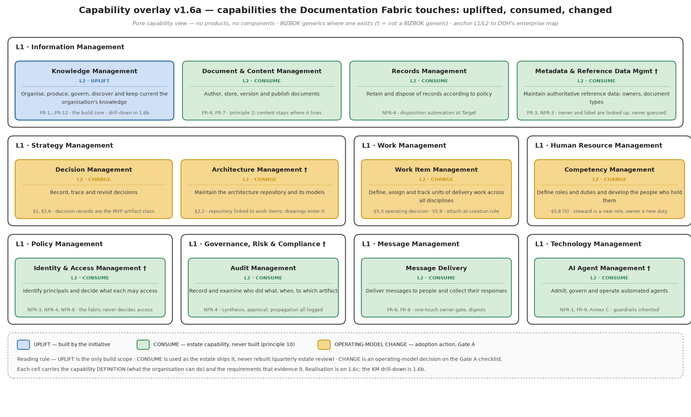
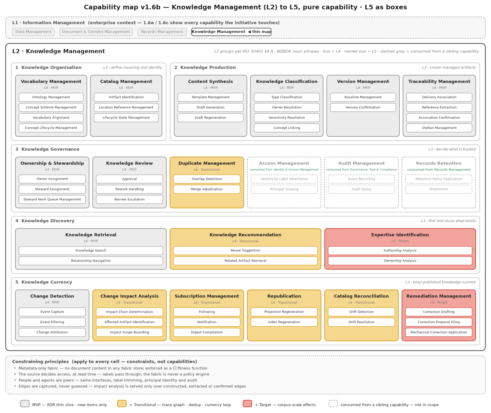
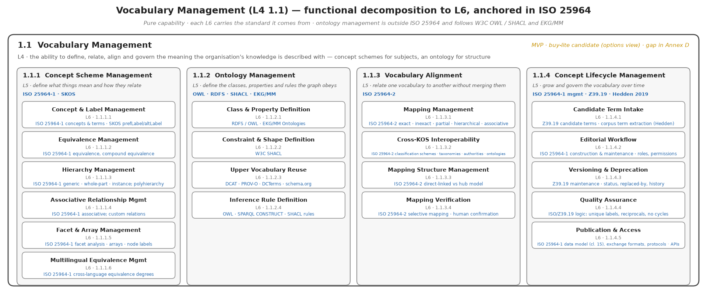
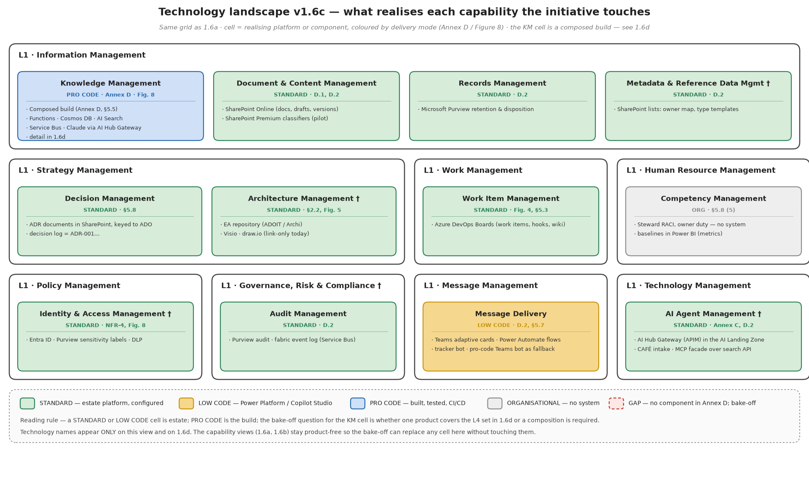
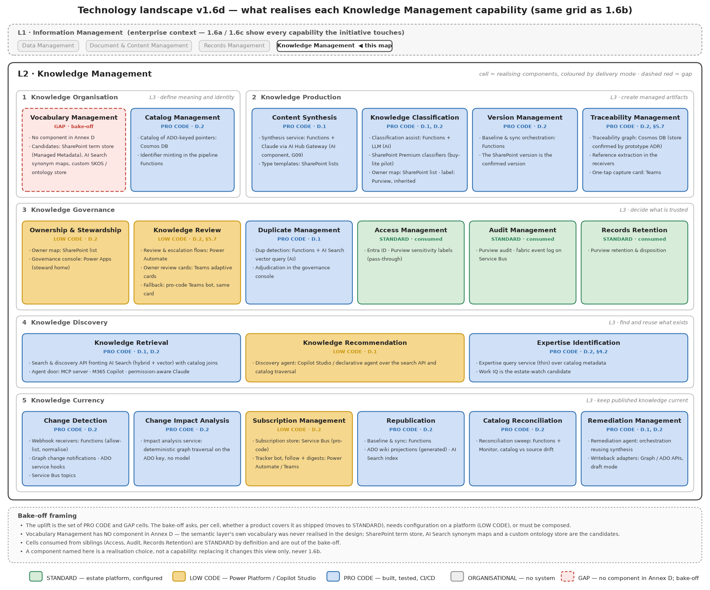
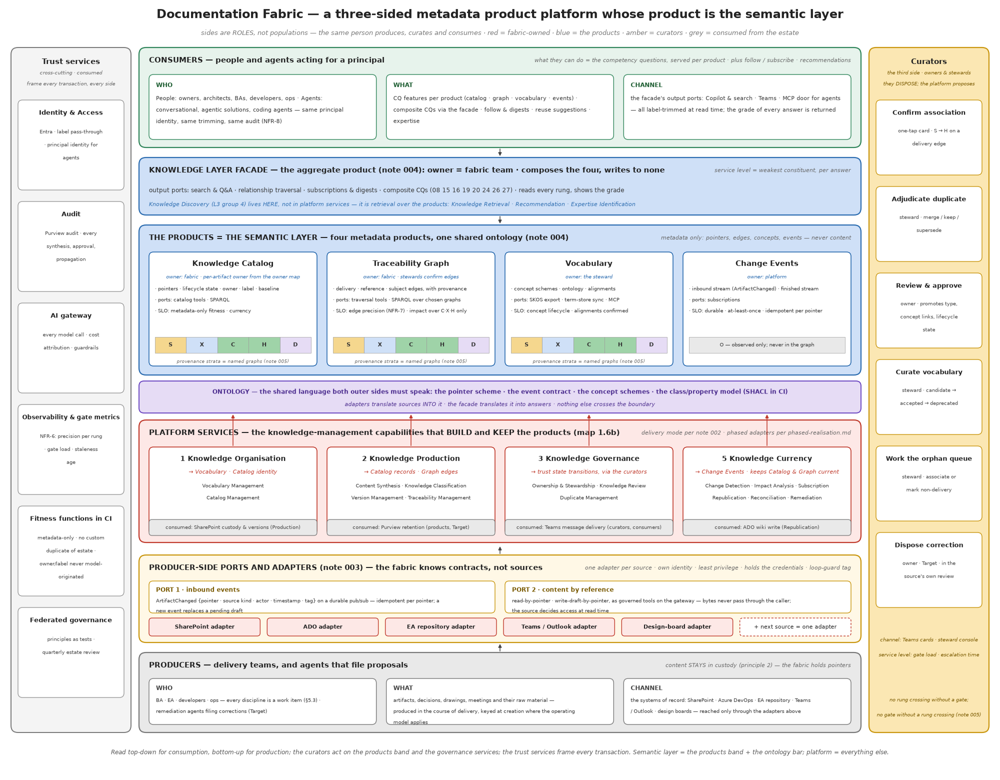
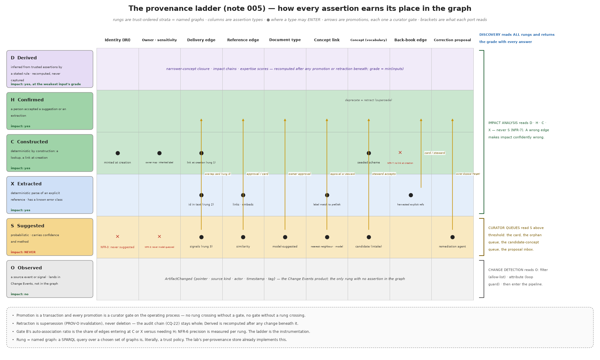
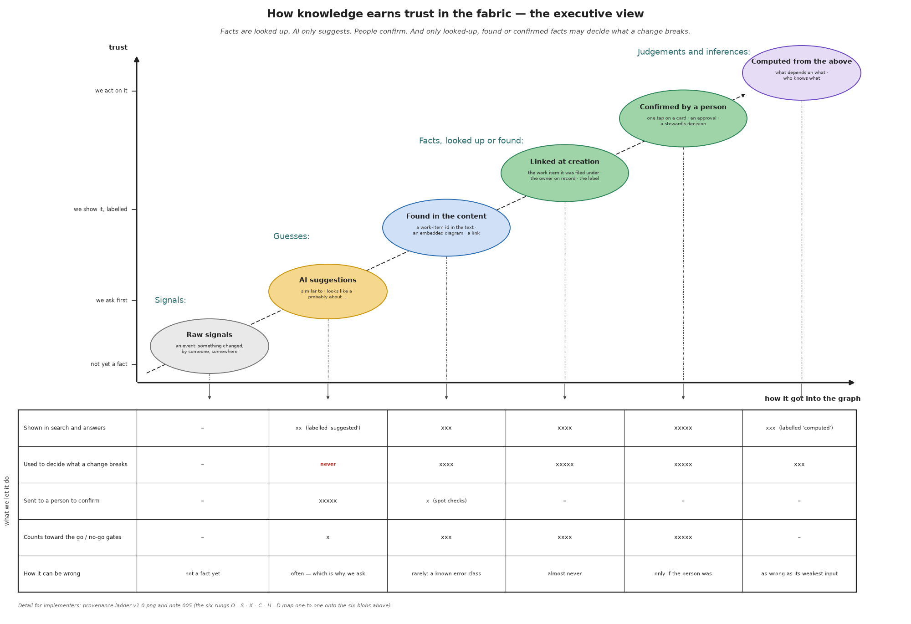
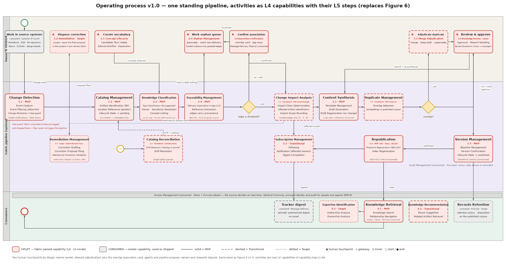
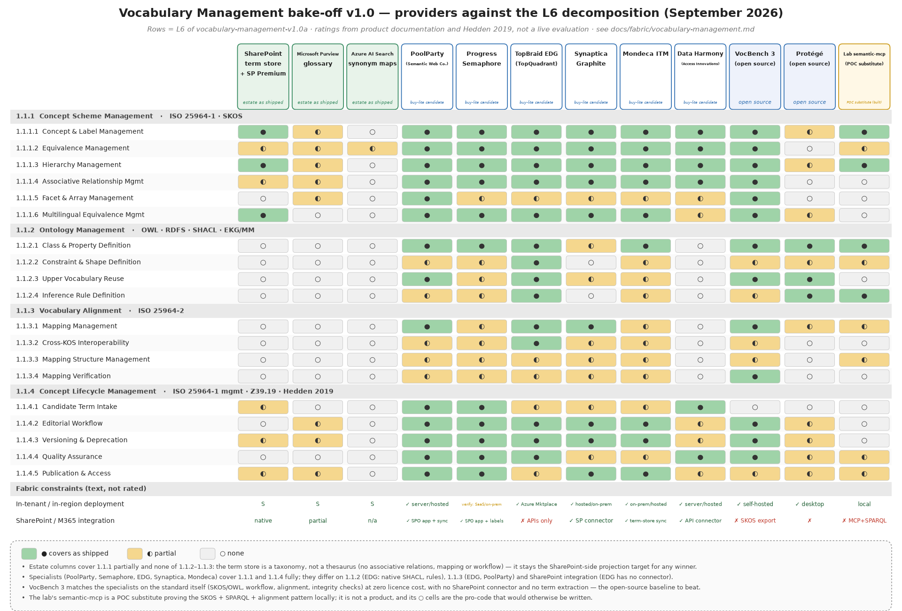

# Documentation Fabric — Functional Requirements Specification (FRS)

Product Delivery Knowledge · Enterprise Architecture · Department of Health Abu Dhabi · Version 2.0 draft · September 2026

**Who this is for.** Architects, engineers, data and platform teams, and the design authority. It specifies what the fabric does, how it is structured, how it is realised per phase, and how it is verified. The Business Requirements Specification (BRS v2.0) states the problem, the stakeholders, the outcomes and the courses of action in business terms; this document is consistent with it and cites its business requirements (BR-1 to BR-8).

**Conventions.** Capabilities are numbered as in the capability map (L3 group . L4 . L5, e.g. 2.4.3). Functional requirements are FR-<L4>.<n>. Competency questions are CQ-nn and are the acceptance tests of the semantic layer. Provenance rungs are lettered O · S · X · C · H · D. Phases are POC (the lab), MVP, Transitional, Target. Delivery modes are S (estate as shipped), B (buy-lite), L (low code), P (pro code).

**What changed since v1.0.** The capability model is re-cut on BIZBOK levelling and naming (one L1 context, Knowledge Management at L2, five MECE L3 groups, 21 L4s, L5 throughout, L6 for vocabulary). Five design decisions are recorded as notes and applied throughout: 001 three typed axes, not a work-item hub; 002 the delivery-mode rule; 003 ports, adapters and events; 004 the fabric as four metadata products and one aggregate; 005 the provenance ladder. The market scan is redone against the L4 list. The options view carries two target columns, as designed and reuse-first. Every figure is regenerated from code under `scripts/` and is reproducible.

## 1. Scope

**In scope.** Narrative artifacts of the product delivery lifecycle: documents, decision records, drawings, and the products synthesised from meetings. Their metadata, links, vocabulary, events and drafts. The human gates that govern them. Consumption by people and by agents acting for a principal.

**Out of scope.** Code and tests (already versioned, traced and reviewed in git and ADO). Document content as such — the fabric never stores it. Access policy — the source decides at read time. Any migration of content between systems of record.

**Systems of record (custody stays here).** SharePoint (documents including fabric drafts), Azure DevOps (work items, code, wikis), the EA repository (models and views), Teams and Outlook (transcripts, threads — as pointers), design boards (link-only). The full inventory is confirmed at inception; adding a source is one adapter (§4.6).

## 2. Principles, as engineering constraints

1. **Owners change knowledge; the system proposes.** Fabric writes are limited to drafts, regenerable projections and review proposals filed through each system's own mechanism. Published or human-authored content changes only through a human decision. Fabric-originated writes are tagged and never re-enter the pipeline; a new event for a pointer replaces its pending draft; propagation depth is bounded.
2. **Content stays where it lives.** No fabric store holds document body content: pointers, edges, concepts, embeddings and events only. Enforced as a CI fitness function (§11.2).
3. **The source decides access, at read time.** Labels and permissions pass through; the fabric is never a policy engine.
4. **People and agents are peers.** Same interfaces, same label trimming, same principal identity, same audit. No privileged agent path.
5. **AI suggests; it never decides.** Owner and sensitivity are looked up. Judgements are human. Suggestions carry confidence and are measured per rung (§4.5).
6. **Every artifact carries its own identity; every delivery artifact carries its work-item association** (note 001; supersedes v1.0 "every artifact carries its work-item key").
7. **Edges are captured, never guessed — or derived from captured assertions by a stated rule** (note 005; the derived clause is new). "Unassociated" is a legal state. Impact analysis is served only over rungs C · X · H and what is derived from them.
8. **Only managed artifacts enter the lifecycle.** Raw material stays as pointers.
9. **Complete at every phase; promoted by evidence.** The pipeline shape is final at MVP; promotion is activation of adapters behind ports, not re-plumbing (§10).
10. **Never build what the estate ships.** Quarterly estate review; retirement of custom components on standard equivalents.

## 3. Capability model

### 3.1 Enterprise overlay — what the initiative touches



Knowledge Management is the only uplifted capability. Consumed capabilities are used as the estate ships them and must not be rebuilt (principle 10). Changed capabilities are operating-model decisions on the Gate A checklist: Decision Management (decision records become a managed class), Architecture Management (the EA repository linked to work items), Work Item Management (all disciplines on ADO, attach-at-creation), Competency Management (owner duty, steward role).

### 3.2 Knowledge Management, L2 to L5



The five L3 groups follow ISO 30401 §4.4 knowledge-development stages and partition by the verb applied to knowledge: Organise, Produce, Govern, Discover, Keep current. Access Management, Audit Management and Records Retention are consumed from Identity & Access Management, Governance Risk & Compliance and Records Management respectively; they appear dashed inside Knowledge Governance because the governance flow depends on them.

### 3.3 Vocabulary Management, to L6



### 3.4 Realisation and the delivery-mode rule (note 002)

Delivery mode is assigned per L4 cell in this order: **S** if the estate ships it; **B** if a non-excluded product covers it; **L** only for end-user surfaces and event triggering; **P** for anything that touches a line-of-business system or sits on the data path. Two technology landscapes carry the realisation, one per capability grid.





## 4. Conceptual architecture

### 4.1 The platform and its product



The fabric is a platform with three sides that are roles, not populations: **producers** (delivery teams and, at Target, agents filing proposals), **consumers** (people and agents acting for a principal), and **curators** (owners and stewards, who dispose). Its product is the **semantic layer**: four metadata products and the ontology that binds them. The platform is everything that builds, governs and serves that product: the knowledge-management capabilities, the ports and adapters, the gates, and the trust services it consumes.

### 4.2 The knowledge graph has three typed axes (note 001)

| Axis | Edge captured by | Answers | Serves |
|---|---|---|---|
| Delivery | 2.4 Traceability Management · Delivery Association | why, when, by whom, together with what | Currency: impact, re-drafting, accountability |
| Structural | 2.4 Traceability Management · Reference Extraction | what points to what | Currency: impact chains |
| Subject | 2.2 Knowledge Classification · Concept Linking | what it is about | Discovery: search, clustering, dedup, expertise |

Ownership is a fourth axis for Governance, resolved from the owner map — never inferred from a work item's assignee. The work item is one class and the source of one edge type; identity is the artifact's own IRI. "Hanging off" a work item or a concept is a query choice, never a storage decision. Non-delivery artifacts (standards, policies, reference models, runbooks) are complete with subject edges and an owner and no delivery edge; the orphan queue holds only artifacts that look like delivery work and lack a parent.

### 4.3 The products and their contracts (note 004)

| Product | Holds (metadata only) | Owner | Input ports | Output ports | Service level |
|---|---|---|---|---|---|
| Knowledge Catalog | artifact records: IRI, pointer, source kind, type, owner, label, lifecycle state, baseline, timestamps | fabric; per-artifact owner from the owner map | pipeline writes (2.x, 5.x) | catalog tools; SPARQL | metadata-only fitness (CQ-03); currency (CQ-24) |
| Traceability Graph | edges: delivery, reference, subject; each with rung, method, actor, confidence, timestamps | fabric; stewards confirm | pipeline writes; curator promotions | traversal tools; SPARQL over chosen named graphs | edge precision per rung (NFR-7); impact over C·X·H·D only |
| Vocabulary | concept schemes (SKOS), ontology (RDFS/OWL + SHACL), alignments, concept lifecycle | the steward | candidate intake; steward workflow | SKOS export; term-store sync; MCP tools | concept lifecycle; alignments human-confirmed |
| Change Events | inbound stream (ArtifactChanged), finished stream (RunFinished) | platform | adapters | subscriptions | durable; at-least-once; idempotent per pointer |
| Knowledge Layer facade (aggregate) | nothing of its own | fabric team | — | search & Q&A; traversal; subscriptions & digests; composite CQs; the MCP door | weakest constituent, per answer; returns per-constituent provenance |

The embedding index is **not** a product: derived, rebuildable, used as a mechanism by composite answers. Each product registers as a Purview Unified Catalog data product at Target.

### 4.4 The ontology — the shared language

Both outer sides speak the ontology and nothing else crosses the boundary. It has four parts.

- **Pointer scheme.** Every artifact has one IRI minted by the fabric and one or more pointers into systems of record. Example IRI: `urn:fabric:artifact:01J9X5K7QZ3M8N2P4R6T8V0W1Y` (ULID, opaque, never derived from a path). Example pointer: `{"source":"sharepoint","site":"<site-id>","driveItem":"<item-id>","version":"3.0"}`; for ADO `{"source":"ado","project":"<id>","workItem":4471}`.
- **Event contract.** `ArtifactChanged` (§4.6.1) and `RunFinished`.
- **Concept schemes.** SKOS, one scheme per business construct family (capabilities, systems, products, processes, document types), with `skos:exactMatch` across schemes in a mappings graph. Seeded from the reference models, the EA repository and ADO area paths at inception; grown by candidate intake.
- **Class and property model.** RDFS/OWL classes: `fab:Artifact` (a `dcat:Resource` with a `dcat:accessURL` pointer), `fab:WorkItem`, `fab:Person`, `fab:DocumentType` (a `skos:Concept`), `fab:Source`. Properties: `fab:deliveredUnder`, `fab:references`, `dcterms:subject`, `fab:ownedBy`, `fab:sensitivityLabel`, `fab:lifecycleState`, `fab:baselineVersion`. Reused vocabularies: DCAT for the pointer pattern, PROV-O for every assertion's provenance, Dublin Core Terms for descriptive metadata, SKOS for subjects and types, schema.org/FOAF for people (mapped to Entra object ids). SHACL shapes validate every record in CI and at write time.

Example (Turtle) of one artifact and one confirmed delivery edge:

```
@prefix fab:  <urn:fabric:ont#> .
@prefix prov: <http://www.w3.org/ns/prov#> .
@prefix dcat: <http://www.w3.org/ns/dcat#> .
@prefix dct:  <http://purl.org/dc/terms/> .

<urn:fabric:artifact:01J9X5K7QZ3M8N2P4R6T8V0W1Y> a fab:Artifact , dcat:Resource ;
    dct:title "ADR-014 Event bus for claims intake" ;
    dcat:accessURL <https://.../sites/ea/Shared%20Documents/ADR-014.docx> ;
    fab:documentType <urn:fabric:concept:doc-type:adr> ;
    fab:ownedBy <urn:fabric:person:oid-3f2a…> ;
    fab:sensitivityLabel "Confidential" ;
    fab:lifecycleState fab:Published ;
    fab:baselineVersion "3.0" .

GRAPH <urn:fabric:graph:H> {
  <urn:fabric:artifact:01J9X5K7…> fab:deliveredUnder <urn:fabric:workitem:ado:4471> .
}
<urn:fabric:assertion:…> a prov:Entity ; prov:wasAttributedTo <urn:fabric:person:oid-…> ;
    prov:generatedAtTime "2026-09-11T08:12:00Z"^^xsd:dateTime ; fab:method "one-tap card" ; fab:confidence 1.0 .
```

### 4.5 The provenance ladder (note 005)

Every assertion — identity, edge, concept link, type, owner — enters at one rung and can be promoted; each rung is a named graph.





Rules that are requirements: identity, owner and sensitivity enter at C only; back-book edges enter at X or H only; document type enters at S and is promoted by owner approval; promotion is a curator gate and there is no crossing without one; retraction is PROV-O supersession, never deletion; D is recomputed after any change beneath it; each output port declares the rungs it reads.

### 4.6 Ports, adapters and events (note 003)

The fabric exposes two contracts per source and holds no source credential. A per-source adapter — one app registration, least privilege on its source — satisfies both.

#### 4.6.1 Port 1 — inbound events

Durable pub/sub (Redis Streams locally; Service Bus topics at Transitional; Eventstreams at Target). One event kind at MVP:

```
ArtifactChanged {
  "eventId":   "01J9X6…",                      // ULID
  "pointer":   {"source":"sharepoint","site":"…","driveItem":"…","version":"4.0"},
  "sourceKind":"sharepoint|ado|ea-repo|teams|design-board",
  "change":    "created|updated|deleted|moved|relabelled",
  "actor":     {"oid":"…"},                     // principal in the source
  "occurredAt":"2026-09-11T08:10:31Z",
  "fabricTag": null | {"runId":"…","kind":"draft|projection|proposal"}   // set on fabric-originated writes
}
```

Idempotency key = `pointer` (source + item id). A new event for a pointer with a pending draft replaces that draft. Events carrying a `fabricTag` are dropped by Change Attribution (5.1.3) and never re-enter the pipeline.

#### 4.6.2 Port 2 — content by reference

Governed tools registered with the gateway, granted per team, metered and traced: `source_read(pointer) → {text, figures[], metadata}`; `source_read_versions(pointer)`; `source_write_draft(pointer_folder, artifact_ref, fabricTag) → pointer`; `source_write_proposal(pointer, proposal_ref, mechanism)` (Target; tracked changes, ADO suggested update, wiki pull request). Bytes never pass through the caller; the source's access decision applies at read time.

#### 4.6.3 Adapter duties

Subscribe and translate (port 1); resolve pointers (port 2); tag fabric-originated writes and filter them on the way back in; expose no source API to the fabric. Adding a source = one adapter, one gateway registration, one grant.

## 5. Operating process



| Step | Capability | Input | Output | Rung effect | On failure |
|---|---|---|---|---|---|
| Change event | 5.1 Change Detection | ArtifactChanged | filtered, attributed event | O | dead-letter after 3 attempts; sweep (5.5) recovers |
| Identify | 1.2 Catalog Management | event | catalog record (state = pending) or existing record | C (identity) | none — deterministic |
| Classify | 2.2 Knowledge Classification | record + content via port 2 | type (S), owner (C), label (C), concept links (X/S) | S/X/C | type unresolved → record stays pending, steward notified |
| Associate | 2.4 Traceability Management | record + content + ADO links | delivery edges (C/X/S), reference edges (X/S) | C/X/S | below threshold → one-tap card; no candidate → orphan queue |
| Impact | 5.2 Change Impact Analysis (Transitional; MVP pass-through) | trusted edges | affected set with chain and depth | reads C/X/H/D | — |
| Synthesise | 2.1 Content Synthesis | record, content, template, affected passages | draft written via port 2 with fabricTag | — | model call fails → retry via gateway; then steward |
| Overlap | 3.3 Duplicate Management (Transitional; MVP routes "no") | draft embedding vs published corpus | overlap flag | S | flagged → steward adjudication |
| Review | 3.2 Knowledge Review | draft, card | approve / rework / escalate | S→H (type, concept links); pending→published | timer → line manager |
| Baseline | 2.3 Version Management | approval | baseline record; version confirmed | C | — |
| Republish | 5.4 Republication | baseline | wiki projection; index refreshed | D recomputed | projection failure ≠ run failure; retried |
| Notify | 5.3 Subscription Management | baseline; affected set | notifications; digest entries | — | delivery failure retried; never blocks |
| Reconcile | 5.5 Catalog Reconciliation (Transitional) | timer | drift events into port 1 | O | — |
| Remediate | 5.6 Remediation Management (Target; button-first late Transitional) | affected set | proposal filed via port 2 | S→H on owner disposal | — |

## 6. Functional requirements

Each L4 carries its L5 requirements, acceptance (CQs), phase, delivery mode (as designed / reuse-first) and an MVP realisation example.

### FR-1.1 Vocabulary Management (BR-1) — MVP · G/B

- FR-1.1.1 Concept Scheme Management: maintain SKOS concept schemes with preferred and alternate labels, definitions, hierarchical and associative relations, facets, multilingual labels (ISO 25964-1).
- FR-1.1.2 Ontology Management: maintain the class/property model (§4.4), SHACL shapes, upper-vocabulary reuse, and inference rules; the model is versioned in git and validated in CI.
- FR-1.1.3 Vocabulary Alignment: maintain cross-scheme mappings (exact, close, broad, narrow) in a mappings graph; every mapping is human-confirmed (rung H) before it is read by discovery closure.
- FR-1.1.4 Concept Lifecycle Management: candidate intake from tagging misses and clustering; editorial workflow; versioning and deprecation (never deletion); quality checks (unique preferred labels, reciprocals, no cycles); publication (SKOS export, term-store sync, MCP).
- Acceptance: CQ-17, CQ-18; every SHACL fitness function.
- MVP realisation: SharePoint term store for subject schemes + SKOS/SHACL files in git validated in CI; Transitional VocBench 3 or a specialist platform per the bake-off (§9.2).

### FR-1.2 Catalog Management (BR-1) — MVP · P

- FR-1.2.1 Artifact Identification: mint one IRI per artifact (ULID) at first sight; never derive it from a path; resolve any pointer to its IRI.
- FR-1.2.2 Location Reference Management: hold one or more pointers per artifact; a record holds no content field of any kind (NFR-2).
- FR-1.2.3 Lifecycle State Management: states `pending → in-review → published | withdrawn`, with `unassociated` as a legal flag; transitions only by the steps in §5.
- Acceptance: CQ-01, CQ-02, CQ-03, CQ-04, CQ-25.
- MVP realisation: Cosmos DB serverless, one container for records, edges and embeddings; partition key = IRI.

### FR-2.1 Content Synthesis (BR-2) — MVP · P

- FR-2.1.1 Template Management: one template per confirmed document type, held as a SharePoint list item; versioned.
- FR-2.1.2 Draft Generation: synthesise a draft from the artifact's content (port 2), its template and, where available, the affected passages; every model call through the AI gateway; the draft is written via port 2 with a fabricTag; catalog state = pending.
- FR-2.1.3 Draft Regeneration: on a new event for a pointer with a pending draft, regenerate and replace; never stack.
- Acceptance: synthesis pilot threshold (approval without substantive rewrite) on ~10 real transcripts; CQ-04.
- MVP realisation: Functions on consumption; templates in a SharePoint list.

### FR-2.2 Knowledge Classification (BR-2) — MVP · S/P

- FR-2.2.1 Type Classification: suggest the document type with a confidence (rung S); the owner's approval promotes it to H.
- FR-2.2.2 Owner Resolution: look up the owner from the owner map by site/library/folder; never model-guessed (rung C); unresolved → steward.
- FR-2.2.3 Sensitivity Resolution: read the inherited Purview label; never model-guessed (rung C).
- FR-2.2.4 Concept Linking: link subjects by label match against the schemes (rung X) and by nearest neighbour/model (rung S); misses go to candidate intake.
- Acceptance: CQ-12, CQ-13, CQ-15; classification accuracy per type before a type onboards (NFR-6).
- MVP realisation: type suggested by the same model call as the draft; SharePoint Premium classifier pilot only if it beats it on measured accuracy.

### FR-2.3 Version Management (BR-2) — MVP · S

- FR-2.3.1 Baseline Management: on approval, record the baseline (version, approver, time) on the catalog record.
- FR-2.3.2 Version Confirmation: confirm the SharePoint version id at baseline; a later source version without a baseline is drift (5.5).
- Acceptance: CQ-04.

### FR-2.4 Traceability Management (BR-2) — MVP · P

- FR-2.4.1 Delivery Association: rung 1 = ADO link at creation (C); rung 2 = work-item id in text (X); rung 3 = signals with confidence (S); rung 4 = one-tap card (H). Threshold configurable; nothing below threshold is committed without confirmation.
- FR-2.4.2 Reference Extraction: extract links, embedded diagrams and id mentions into reference edges (X).
- FR-2.4.3 Association Confirmation: the card carries the evidence for the suggestion (shared concepts, authorship, time window) and offers candidates beside free text; no answer within the timer → orphan queue.
- FR-2.4.4 Orphan Management: the steward queue holds artifacts that look like delivery work and lack a parent; "non-delivery" is a valid disposition.
- Acceptance: CQ-05 to CQ-09, CQ-11; auto-association ratio (Gate B).
- MVP realisation: edges as Cosmos documents with rung, method, actor, confidence; card via Teams.

### FR-3.1 Ownership & Stewardship (BR-3) — MVP · L

- FR-3.1.1 Owner Assignment from the owner map; FR-3.1.2 Steward Assignment per scheme and per queue; FR-3.1.3 Steward Work Queue Management: orphan queue, candidate concepts, duplicate flags, proposal inbox, with load metrics.
- Acceptance: CQ-14; per-owner and per-steward load reported from day one.

### FR-3.2 Knowledge Review (BR-3) — MVP · L

- FR-3.2.1 Approval: one-touch card in Teams with the draft's pointer, type, concept links and evidence; approve / request changes.
- FR-3.2.2 Rework Handling: "changes requested" keeps the item open and triggers regeneration with the owner's comment.
- FR-3.2.3 Review Escalation: timer to the line manager; digest batching for owners with many cards.
- Acceptance: gate load sustainable at multi-type volume (Gate B).

### FR-3.3 Duplicate Management (BR-3) — Transitional · P

- FR-3.3.1 Overlap Detection: before review, compare the draft's embedding with the published corpus; flag above threshold with the shared concepts and work item as evidence (S).
- FR-3.3.2 Merge Adjudication: steward decides merge / keep both / supersede; the decision is a promotion (H) and is audited.
- Acceptance: CQ-19. MVP: the gateway routes "no"; embeddings are still stored.

### FR-4.1 Knowledge Retrieval (BR-4) — MVP · S

- FR-4.1.1 Knowledge Search over the published corpus with label trimming at read time; results carry owner, state and provenance grade.
- FR-4.1.2 Relationship Navigation: traverse delivery, reference and subject edges from any artifact or concept, with the rungs read declared.
- Acceptance: CQ-16, CQ-21 (consumed), CQ-27. MVP: Microsoft Search and Copilot over SharePoint; catalog joins in Functions; Transitional: the Work IQ MCP door and a thin fabric facade.

### FR-4.2 Knowledge Recommendation (BR-4) — Transitional · L

- FR-4.2.1 Reuse Suggestion before creation, by concept and work item; FR-4.2.2 Related Artifact Retrieval via graph joins.
- Acceptance: CQ-20.

### FR-4.3 Expertise Identification (BR-4) — Target · S

- FR-4.3.1 Authorship Analysis and FR-4.3.2 Ownership Analysis over catalog metadata, recency-weighted; no content is read. Acceptance: CQ-26.

### FR-5.1 Change Detection (BR-5) — MVP · L/P

- FR-5.1.1 Event Capture is the adapter's duty (note 003); FR-5.1.2 Event Filtering by allow-list (sites, projects, item types); FR-5.1.3 Change Attribution drops events carrying a fabricTag.
- Acceptance: CQ-23 must answer "none".

### FR-5.2 Change Impact Analysis (BR-5) — Transitional · P

- FR-5.2.1 Impact Chain Determination over rungs C · X · H (+ D) only; FR-5.2.2 Affected Artifact Identification with the passage or element affected; FR-5.2.3 Impact Scope Bounding by depth and by artifact class.
- Acceptance: CQ-10, CQ-11; precision measured on live work items before Transitional (Gate B). MVP: pass-through.

Example — CQ-10 over trusted graphs only (SPARQL):

```
SELECT ?affected ?depth WHERE {
  GRAPH ?g { ?affected (fab:references|fab:deliveredUnder)+ <urn:fabric:artifact:CHANGED> }
  FILTER (?g IN (<urn:fabric:graph:C>, <urn:fabric:graph:X>, <urn:fabric:graph:H>))
  # depth bounding applied by the traversal service; ?g never includes graph:S
}
```

### FR-5.3 Subscription Management (BR-5) — Transitional · L

- FR-5.3.1 Following of artifacts, work items and concepts; FR-5.3.2 Notification of affected owners on impact; FR-5.3.3 Digest Compilation on a schedule; events, never email.
- Acceptance: CQ-24.

### FR-5.4 Republication (BR-5) — MVP wiki · Transitional rebuild · P

- FR-5.4.1 Projection Regeneration: ADO wiki page per published artifact, regenerable, tagged as fabric-originated; FR-5.4.2 Index Regeneration after baseline.
- Acceptance: CQ-04.

### FR-5.5 Catalog Reconciliation (BR-5) — Transitional · P

- FR-5.5.1 Drift Detection: periodic comparison of catalog records with sources via port 2 (deleted, moved, relabelled, new version without baseline); FR-5.5.2 Drift Resolution: emits ArtifactChanged into port 1, never writes the catalog directly.
- Acceptance: CQ-25.

### FR-5.6 Remediation Management (BR-5) — Target (button-first late Transitional) · P

- FR-5.6.1 Correction Drafting for an affected artifact, reusing 2.1; FR-5.6.2 Correction Proposal Filing through the target system's own review mechanism via port 2 (S); FR-5.6.3 Mechanical Correction Application only for owner-whitelisted edit types, dry-run and revert.
- Acceptance: remediation approval rate (Gate C); owner-invoked first, unprompted only after the threshold.

### Consumed capabilities — interface requirements

- **Access Management** (Identity & Access): principal identity for people and agents (Entra); label trimming at read time by the source; CQ-21 answered identically for a person and for an agent acting for them.
- **Audit Management** (GRC): every synthesis, approval, promotion, publication and propagation recorded with actor, time and run id; CQ-22.
- **Records Retention** (Records Management): Purview policies apply to the published corpus; disposition at Target.

## 7. Competency questions — the acceptance suite

The 27 competency questions are the functional features of the products' output ports. Each is implemented as a SPARQL query or tool call and accepted by a test over fixture triples, before any production triple exists. They are grouped by product; the composite questions belong to the aggregate. The full table is Annex E.

## 8. Non-functional requirements

| ID | Requirement |
|---|---|
| NFR-1 Residency | All processing and storage in-region (Azure UAE North / M365 UAE geo); every model call through the AI Hub Gateway; no metadata leaves the tenant estate. Work IQ and any Fabric capacity are used only once their UAE residency is verified. |
| NFR-2 Metadata only | No fabric store holds document body content. Enforced by SHACL in CI and at write time (§11.2). |
| NFR-3 Deterministic governance data | Owner and sensitivity are resolved from reference stores (rung C only); access is decided by the source at read time. |
| NFR-4 Security and audit | Entra identity throughout; adapters hold source credentials, the fabric holds none; full audit of synthesis, approval, promotion, publication, propagation. |
| NFR-5 Severability | Each phase is complete; later-phase components are adapters behind ports and can be removed without breaking earlier operation. |
| NFR-6 Quality gates | Measured, published, per rung where applicable: approval-without-rewrite share; impact precision on live work items; classification accuracy per type; auto-association ratio; remediation approval rate; gate load per owner and steward. |
| NFR-7 Association integrity | No edge below threshold committed without confirmation; unassociated is legal; impact served over C·X·H·D only; back-book edges never enter at C. |
| NFR-8 Consumer parity | Identical interfaces, trimming, principal identity and audit for people and agents; no privileged agent path. |
| NFR-9 Write authority | Drafts, projections and proposals only; fabric writes tagged; re-drafts replace pending drafts; propagation depth bounded; auto-apply only whitelisted mechanical edits with dry-run and revert. |
| NFR-10 Provenance | Every assertion carries rung, method, actor, confidence and time; retraction is supersession; the grade is returned with every answer. |
| NFR-11 Event integrity | Inbound events durable, at-least-once, idempotent per pointer; dead-lettered after bounded retries; reconciliation recovers misses. |
| NFR-12 Product service levels | Each product publishes its service level (§4.3) and the aggregate inherits the weakest per answer. |
| NFR-13 Cost | No reserved platform capacity before Target; consumption-billed services under caps; fixed monthly cost per phase as in §10. |

## 9. Options and sourcing

### 9.1 Market scan against the L4 list

The two options views — incumbents product by product, and provider classes — are BRS Figures 4 and 5 and are not repeated here; this section records the findings and the target compositions they carry.

Findings (September 2026; documentation-based, not a live evaluation — `market-scan-2026-09.md`):

- No single product covers the L4 set; the estate as shipped scores 5 full, 11 partial, 1 none of the 18 owned L4s. The none is Change Impact Analysis.
- Atlassian's Teamwork Graph with Rovo is the nearest single-product shape (work item ↔ page ↔ code captured at creation; agentic writeback) and is excluded because it requires Jira and Confluence as systems of record. It is the reference for what the composition should feel like.
- Vocabulary Management has a mature specialist market (PoolParty, Semaphore, TopBraid EDG, Synaptica, Mondeca) and an open-source baseline (VocBench 3) — the second buy-lite candidate.
- "Impact analysis has zero market coverage" (v1.0) is reworded to "no general-purpose coverage": Swimm proves detect-and-fix in the code domain.
- Work IQ (GA June 2026; MCP, REST, A2A; consumption billing) moves from "watch" to "consume at Transitional" for retrieval, expertise and rung-3 signals. Glean's read-only verdict is stale; its exclusion stands on residency.
- Curated knowledge-base suites are the pattern proof for Governance and are excluded by federation.

### 9.2 Vocabulary Management bake-off



Shortlist: PoolParty, Semaphore, TopBraid EDG, with VocBench 3 as the open-source control and the SharePoint term store as the mandatory projection target. Decide: whether the fabric's ontology lives in the tool or in code with SHACL in CI; term-store sync fidelity (labels and hierarchy survive, associative relations and mappings do not); residency of hosted offerings.

### 9.3 The two target columns

The options view carries the composition **as designed** (Annex D of v1.0) and **reuse-first** (note 002). They differ exactly where the estate ships what the design planned to build — Classification, Version Management, Retrieval, Expertise — and where a buy-lite covers the gap (Vocabulary). Reuse-first outcome: 7 S · 1 B · 5 L · 8 P; the pro-code cells are Catalog, Content Synthesis, Traceability, Duplicate detection, Impact Analysis, Republication, Reconciliation, Remediation.

### 9.4 Estate platforms on the horizon

- **Work IQ** — the M365 content and people axis; the MCP door for agents (NFR-8) and rung-3 signals; Transitional.
- **Fabric IQ** — the meaning and relationships axis over OneLake (Graph GA, Ontology preview); a credible Target realisation of the store, graph and event ports; not a thesaurus, so Vocabulary Management stays with the bake-off; gated on Ontology GA, UAE residency and the metadata-only rule in CI.
- **Foundry IQ** — agent retrieval over knowledge bases; Target.

## 10. Phased realisation

Every phase step is an adapter swap behind a port; the pipeline shape is final at the POC and does not change afterwards.

### 10.1 The POC plateau — the lab as a laptop-local substitute stack

The one-week standalone proof (BRS §7.3) runs on the local agentic lab, which already holds every port the fabric needs with an adapter behind it, and whose design rule is pattern parity with the Azure target: every agent authenticates, egresses through a gateway, is metered, PII-scanned and traced. The POC is evidence only and throwaway by declaration; what it proves carries forward because the ports are the same.

| Fabric element | POC realisation in the lab | Azure counterpart it stands in for |
|---|---|---|
| Pipeline host (§5) | one Agent Framework workflow, `change_to_adr`, as a `ProcessSpec`; deterministic nodes for identify, associate, baseline; agent nodes for classify and synthesise; run under the shared `governed_run` skeleton (root span, trace id, run board) | Azure Functions pipeline + Container Apps |
| Store — catalog, embeddings | Postgres (Neon): catalog and edge tables alongside the existing artifact store; embeddings via the gateway's nomic model into pgvector | Cosmos DB serverless (MVP) |
| Graph — edges, provenance, traversal | `semantic-mcp` rdflib store: one named graph per rung (O·S·X·C·H·D), SPARQL over a chosen set of graphs is the trust policy; derivation via CONSTRUCT | Cosmos adjacency (MVP) → Fabric Graph (Target) |
| Event — port 1 | Redis Streams (`workflow:requests`, `workflow:finished`), consumer groups, idempotency by `SET NX` on the pointer, reclaim of unacked entries, dead-letter after bounded retries | Storage Queue (MVP) → Service Bus → Eventstreams |
| Content by reference — port 2 | `storage-mcp` (read by `art://` ref, never bytes through the agent) and `collab_mcp` (`collab_fetch` in, `collab_put` out, handle-addressed, fabric writes carry the tag) | Graph / ADO APIs behind adapters |
| Source adapters | `collab_mcp` (SharePoint drive, Teams meetings and recordings via Microsoft Graph); `adoit-mcp` (EA repository, read; staged import for write); **new: an ADO adapter** (work items, service hooks) — the only adapter the POC has to build | per-source adapters |
| Vocabulary | `semantic-mcp` SKOS store (the capability reference schemes already loaded, cross-scheme `exactMatch` in a mappings graph); SKOS and SHACL files in git, validated in CI | term store + git (MVP) → VocBench → specialist platform |
| Retrieval — people and agents | the reference layer's search through the gateway; SPARQL and traversal as gateway-registered MCP tools; one door for the review app and for agents (per-team grants) | Microsoft Search + Copilot (MVP) → Work IQ MCP |
| Review surface — curators | the review app (Streamlit) plus the Teams adaptive-card channel already built (`approvals` on Redis Streams, `human_decision` with a named actor, escalation timer to add); Telegram as the second channel | Teams Approvals + Power Automate |
| Projection | Markdown per published artifact (the ADO-wiki shape); optionally opened as an Obsidian vault so a reviewer sees the graph without a UI | ADO wiki |
| Trust services | Entra per agent (MSAL client credentials → gateway virtual key), LiteLLM gateway (teams, keys, per-tool ACLs, spend), Presidio PII guardrail, OpenTelemetry → Jaeger (one trace per run, the audit trail), governance tests as fitness functions | Entra, AI Hub Gateway, Purview audit, Monitor, CI checks |
| Cloud tier | Railway (substrate + workload images, immutable `sha-` tags, CD from `main`) for the two-week integrated proof against live work items and a pilot site | Container Apps |

What the POC must demonstrate: the ArtifactChanged contract end to end from a SharePoint change to a published projection; the ladder as named graphs with one promotion through the Teams card; CQ-01 to CQ-07, CQ-10, CQ-12, CQ-13, CQ-15, CQ-17, CQ-23 answered over real triples; the metadata-only SHACL shape failing a deliberate violation in CI. Cost: negligible — the substrate at Hobby-plan rates, consumption-priced inference.

### 10.2 Ports and adapters by phase

| Port | POC adapter (lab) | MVP adapter | Transitional adapter | Target adapter |
|---|---|---|---|---|
| Store (catalog, embeddings) | Postgres (Neon) + pgvector | Cosmos DB serverless | Cosmos + Purview registration | OneLake + Purview Unified Catalog |
| Graph (edges, traversal) | rdflib named graphs, SPARQL (`semantic-mcp`) | Cosmos adjacency documents | traversal service in Functions | Fabric Graph |
| Event (change → pipeline) | Redis Streams | Storage Queue | Service Bus topics | Eventstreams + Activator |
| Content by reference | `storage-mcp`, `collab_mcp` | Graph / ADO adapters | same | same |
| Retrieval (people and agents) | gateway-registered MCP tools; reference-layer search | Graph search API + Copilot | Work IQ MCP | + Foundry IQ, Fabric IQ ontology MCP |
| Vocabulary | `semantic-mcp` SKOS + git | term store + SKOS in git | VocBench 3 | PoolParty / Semaphore + Fabric IQ Ontology |
| Review surface | review app + Teams card channel | Teams Approvals + Power Automate | + Power Apps console | pro-code Teams bot |
| Model gateway | LiteLLM (Ollama Cloud, Claude) | AI Hub Gateway | same | same |

### 10.3 What each phase costs to keep on

| Phase | Fixed monthly (order of magnitude, list prices) | Deliberately absent |
|---|---|---|
| POC | negligible: Railway Hobby substrate, Neon free tier, flat-rate inference | everything Azure-specific; nothing is licensed |
| MVP | tens of USD | AI Search, Service Bus, Copilot Studio, Fabric, vocabulary licence, Work IQ |
| Transitional | low hundreds | Fabric capacity, commercial taxonomy licence |
| Target | F-SKU capacity + taxonomy licence + AI Search Standard + Foundry IQ | — |

Per-capability realisation by phase is in `phased-realisation.md`.

## 11. Verification

### 11.1 Gates

| Gate | Evidence |
|---|---|
| A (inception → MVP) | six document types confirmed; ADO operating decision ratified; owner/label resolution verified on the pilot site; the two proofs of concept run |
| B (MVP → Transitional) | synthesis pilot approval-without-rewrite ≥ threshold on ~10 transcripts; ADO link-hygiene audit passes; impact precision ≥ target on live work items; auto-association ratio ≥ target; gate load sustainable |
| C (Transitional → Target) | catalog maturity sufficient for expertise answers; remediation approval rate ≥ threshold from owner-invoked use; records governance sign-off |

### 11.2 Fitness functions in CI

- **Metadata only.** A SHACL shape on `fab:Artifact` and on every event forbids any property whose value exceeds a bounded length or matches content types; the build fails on violation. Example:

```
fab:ArtifactShape a sh:NodeShape ; sh:targetClass fab:Artifact ;
  sh:closed true ; sh:ignoredProperties ( rdf:type ) ;
  sh:property [ sh:path dct:title ; sh:maxLength 300 ] ;
  sh:property [ sh:path dcat:accessURL ; sh:minCount 1 ] ;
  sh:property [ sh:path fab:body ; sh:maxCount 0 ] .   # no content property may exist
```

- **Owner and label never model-originated.** Every `fab:ownedBy` and `fab:sensitivityLabel` assertion must sit in graph C with method ∈ {owner-map, inherited-label}.
- **No custom duplicate of an estate standard.** Each pro-code component declares the estate capability it does not duplicate; the quarterly review re-runs the check.
- **Competency questions.** All 27 CQs run as tests over fixture triples; CQ-03 and CQ-23 must answer "none".
- **Per-rung precision.** Sampled audits per rung feed the NFR-6 dashboard.

## 12. Technical risks

| Risk | Mitigation |
|---|---|
| ADO hygiene undermines traceability | hygiene audit and link-backfill before Transitional; impact prototype on live work items as the gate |
| Low-code in the critical path hits limits | note 002 keeps low code to surfaces and triggers; pro-code Teams bot presents the identical card |
| Cosmos adjacency traversal too slow at scale | graph port isolates it; Fabric Graph is the Target adapter; measured at Gate B |
| Metadata-only rule eroded by convenience (OneLake shortcuts, mirroring) | SHACL fitness function in CI and at write time; fails the build |
| Vocabulary sprawl | tagging proposes, the gate resolves against schemes; unmatched labels queue for the steward; schemes seeded, not grown from nothing |
| Work IQ / Fabric IQ residency or billing unverified | consumed only after verification; Cosmos/Storage Queue adapters remain |

## 13. Inception actions (Gate A checklist)

1. Approve MVP scope, the phased posture model and the compose-and-reuse decision (BRS §9).
2. Confirm the six document types.
3. Ratify the ADO operating decision: all disciplines as work items; attach-at-creation; item-workspace auto-link.
4. Seed the vocabulary: capability reference model, EA repository application components, ADO area paths, document types; appoint the steward per scheme.
5. Run the association-ladder spike over a sample of real EA diagram output; measure rung-1/2 yield.
6. Run the two validation prototypes: impact query on live work items (with hygiene audit); ADR synthesis pilot on ~10 transcripts.
7. Run the SharePoint Premium classification pilot against the model on the same document set; run the Vocabulary Management bake-off (§9.2).
8. Stand up the MVP loop on the AI Landing Zone with the Teams owner gate; adapters for SharePoint and ADO only.
9. Instrument from day one: time-to-locate, staleness age, duplication rate, auto-association ratio, per-rung precision, gate load.
10. Write the business competency questions (CQ-27+) with the asker's role; they decide seeding order.

## Annex A — Acronyms

| Acronym | Meaning |
|---|---|
| ADO | Azure DevOps |
| ADR | Architecture Decision Record |
| AILZ / AI Hub Gateway | AI Landing Zone / its APIM-based model gateway |
| BIZBOK | Business Architecture Body of Knowledge (Business Architecture Guild) |
| BR / FR / NFR | Business / Functional / Non-Functional Requirement |
| CAFÉ | the organisation's agentic reference architecture |
| CQ | Competency Question |
| DCAT / PROV-O / SKOS / SHACL / OWL / RDFS | W3C vocabularies and languages used by the ontology |
| EKG/MM | Enterprise Knowledge Graph Maturity Model (EKGF) |
| IRI | Internationalised Resource Identifier |
| KOS | Knowledge Organisation System |
| MCP | Model Context Protocol |
| O · S · X · C · H · D | provenance rungs: observed, suggested, extracted, constructed, human-confirmed, derived |

## Annex B — References

| Reference | Used for |
|---|---|
| BIZBOK Guide (Business Architecture Guild) | capability levelling and naming; initiative-to-capability cross-mapping |
| TOGAF Standard, 10th ed. — business capabilities | capability-based planning |
| ISO 30401 Knowledge management systems (§4.4) | the five L3 groups |
| ISO 25964-1/-2 Thesauri and interoperability | Vocabulary Management L6 |
| ANSI/NISO Z39.19 | controlled-vocabulary maintenance |
| W3C SKOS, RDF/RDFS, OWL, SHACL, PROV-O, DCAT; DCMI Terms | the ontology and its constraints |
| Grüninger & Fox 1995 | competency questions as ontology requirements |
| Zeng 2008; Hodge 2000 | knowledge-organisation spectrum (basis of the executive ladder layout) |
| Hedden 2019 | vocabulary-software selection criteria |
| Dehghani, Data Mesh | data products, aggregate products, federated computational governance |
| EKGF EKG/MM v1.0 | knowledge-graph capability vocabulary |
| Market scan, September 2026 (`market-scan-2026-09.md`) | options and provider verdicts |
| Microsoft Learn / blogs: Work IQ GA (June 2026), Fabric IQ (Build 2026), SharePoint Premium, Purview | estate capabilities and horizon |

## Annex C — CAFÉ conformance

The v1.0 conformance statement stands (archetype A6 with A1/A2 additions; guardrails G06 on the knowledge path and G09 on the owner gate). The conformance render is to be regenerated from the platform view with the `drawio-cafe` skill once the logical view is re-cut; until then the v1.0 Figure 10 applies.

## Annex D — Component catalogue, by phase

| Component | Realises | POC (lab) | MVP | Transitional | Target | Mode |
|---|---|---|---|---|---|---|
| Source adapters (SharePoint, ADO; then EA repo, Teams, design boards) | ports 1 and 2 | `collab_mcp`, `adoit-mcp`, new ADO adapter | Functions + Graph/ADO hooks and APIs | same | same | P |
| Event stream | port 1 | Redis Streams | Storage Queue | Service Bus topics | Eventstreams + Activator | S/P |
| Catalog and graph store | 1.2, 2.4 | Postgres + rdflib named graphs | Cosmos DB serverless | + Purview registration | OneLake + Fabric Graph | P → S |
| Vocabulary store | 1.1 | `semantic-mcp` SKOS + git | term store + SKOS in git | VocBench 3 | PoolParty / Semaphore; Fabric IQ Ontology | S/B |
| Pipeline services (classify, associate, synthesise, baseline, republish, reconcile) | 2.x, 5.x | Agent Framework workflow nodes | Functions (consumption) | same | same | P |
| Impact analysis | 5.2 | SPARQL over C·X·H graphs | pass-through | traversal in Functions | Fabric Graph query | P |
| Duplicate detection | 3.3 | pgvector similarity | off (routes "no") | Cosmos vector search | AI Search / Foundry IQ | P |
| Review cards and escalation | 3.2 | review app + Teams card channel | Teams Approvals + Power Automate | same | pro-code Teams bot | L |
| Steward console | 3.1 | review app queues | SharePoint lists | Power Apps | same | L |
| Retrieval door | 4.1 | gateway MCP tools | Microsoft Search + Copilot | Work IQ MCP + fabric facade | + Foundry IQ, Fabric IQ MCP | S |
| Discovery agent | 4.2 | — | — | Copilot Studio | + Work IQ context | L |
| Tracker bot and digests | 5.3 | meeting notifier pattern | — | Power Automate / Teams | Activator → Teams | L |
| Remediation | 5.6 | — | — | button-first via port 2 | agents + writeback | P |
| Trust services | consumed | Entra, LiteLLM, Presidio, OTel/Jaeger | Entra, Purview, AI Hub Gateway, Monitor | same | same | S |

## Annex E — Competency questions (full)

{{include:competency-questions.md}}

## Annex F — Design notes

{{include:notes/2026-09-10-knowledge-graph-axes.md}}

{{include:notes/2026-09-11-delivery-mode-rule.md}}

{{include:notes/2026-09-11-ports-adapters-events.md}}

{{include:notes/2026-09-11-data-products.md}}

{{include:notes/2026-09-11-provenance-ladder.md}}
