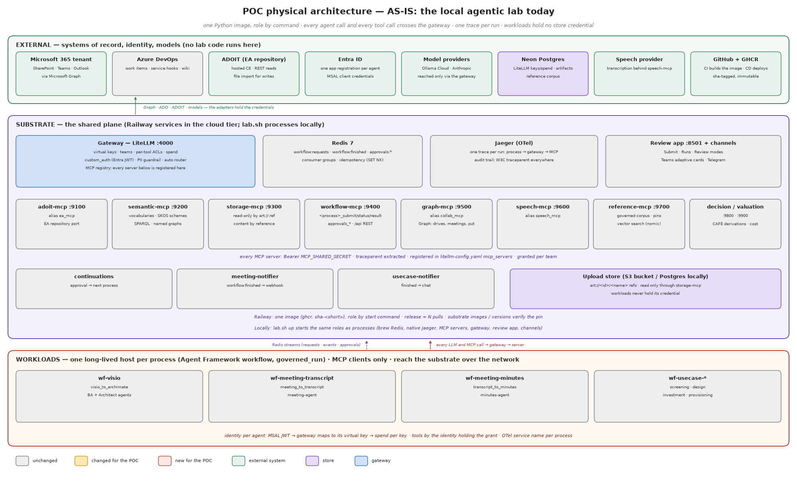
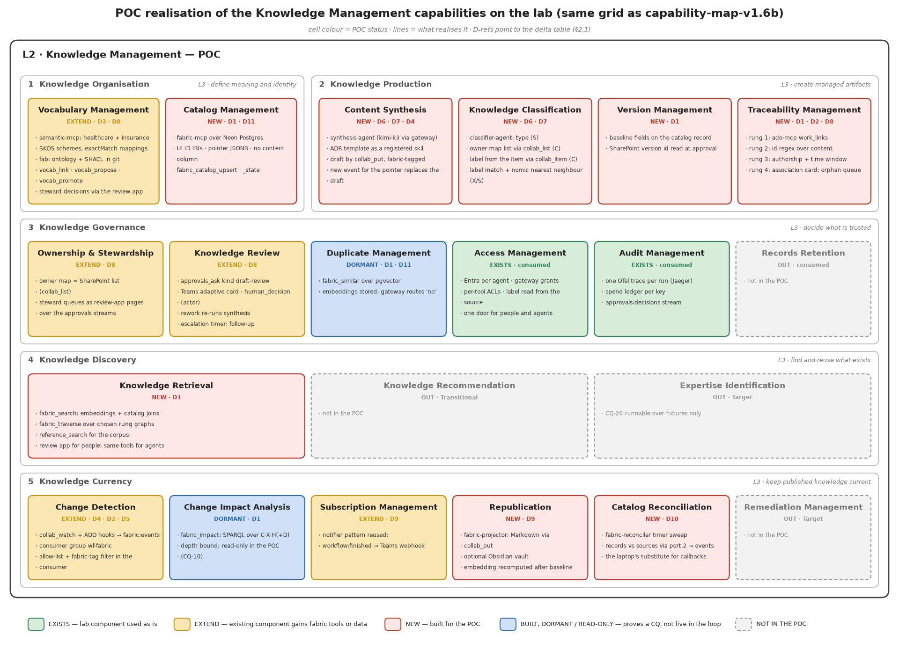
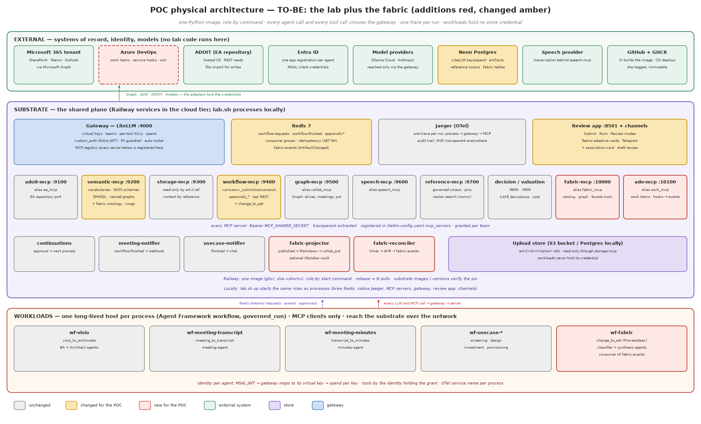

# Documentation Fabric — Proof of Concept on the Local Agentic Lab

Realisation specification · Version 1.1 · 11 September 2026 · companion to BRS v2.0 and FRS v2.0 · v1.1 records what was BUILT (wave 1–6 on branch `feat/doc-fabric`) where it differs from the v1.0 design

**Who this is for.** The people building and running the one-week laptop-local proof and the two-week integrated proof (BRS §7.3, FRS §10.1). It describes the lab as it is, the lab as it must be for the fabric, the delta between them as work packages, and every artifact the solution needs — schemas, contracts, configuration, the baseline vocabulary — with examples that can be copied. It is written against the lab's own rules (CLAUDE.md): pattern parity with Azure, every call through the gateway, workloads hold no store credential, tests first.

**What the POC must demonstrate** (FRS §10.1): the ArtifactChanged contract end to end from a SharePoint change to a published projection; the provenance ladder as named graphs with one promotion through a Teams card; CQ-01 to CQ-07, CQ-10, CQ-12, CQ-13, CQ-15, CQ-17 and CQ-23 answered over real triples; the metadata-only SHACL shape failing a deliberate violation in CI. It is evidence, throwaway by declaration; what carries forward is the ports.

## 1. As-is — the lab today



### 1.1 Tiers and processes

| Tier | Process / service | Port | Role | Holds |
|---|---|---|---|---|
| substrate | gateway (LiteLLM) | 4000 | the one governance plane: virtual keys, teams, per-tool ACLs, spend, PII guardrail, Entra JWT validation, MCP registry, `/v1`, `/mcp`, `/api` pass-through | LiteLLM master key; upstream model keys; Neon DSN |
| substrate | adoit-mcp | 9100 | EA-repository port (`ea_mcp`): search, object, stage import, ArchiMate engine | ADOIT credentials |
| substrate | semantic-mcp | 9200 | vocabularies as data (`semantic_mcp`): ontologies, SKOS schemes, SPARQL over named graphs, `store_spec` | reference workbooks (derived RDF only at runtime) |
| substrate | storage-mcp | 9300 | read-only content by reference (`storage_mcp`): `art://` refs, documents, figures, vsdx | upload-store credential |
| substrate | workflow-mcp | 9400 | the front door (`workflow_mcp`): `<process>_submit/status/result`, `approvals_*`, `/api` REST with Entra app-role authorisation at the gateway | Redis |
| substrate | graph-mcp | 9500 | collaboration port (`collab_mcp`): sites, drives, meetings, `collab_fetch` in, `collab_put` out, change-notification subscriptions | Microsoft Graph app credential |
| substrate | speech-mcp | 9600 | speech port (`speech_mcp`) | provider credential |
| substrate | reference-mcp | 9700 | governed corpus (`reference_mcp`): pinned, signed artifacts; exact lookup and vector search (nomic via the gateway) | reader DSN |
| substrate | decision-mcp, valuation-mcp | 9800, 9900 | CAFÉ derivations, cost and benefit | — |
| substrate | review app | 8501 | Submit · Runs · Review modes; the human channel for approvals | REVIEW_APP_PASSWORD; Redis |
| substrate | channels: teams, telegram | — | approval cards out; decisions in with a named actor | webhook / bot token |
| substrate | continuations, meeting-notifier, usecase-notifier | — | long-lived consumers of `workflow:finished` / approvals | Redis |
| substrate | Redis 7 | 6379 | Streams: `workflow:requests`, `workflow:finished`, `approvals:requests`, `approvals:decisions`; idempotency keys; limiter state | — |
| substrate | Jaeger | 16686 / 4318 | one trace per run; the audit trail | — |
| workloads | wf-visio, wf-meeting-transcript, wf-meeting-minutes, wf-usecase-* | — | one Agent Framework workflow host per `ProcessSpec`, run under `governed_run`; MCP clients only | per-agent Entra client secret or virtual key; nothing else |
| external | Neon Postgres | — | LiteLLM keys and spend; `lab_artifacts` (bytea) artifact store; reference corpus | — |
| external | M365 tenant, Azure DevOps, ADOIT, Entra, Ollama Cloud, Anthropic, speech provider, GitHub/GHCR | — | systems of record, identity, models, CI/CD | — |

### 1.2 Contracts already in place that the fabric reuses

- `lab.platform.contracts`: `ProcessSpec` (one entry generates the three front-door tools), `ToolCatalogue` per server with READ/WRITE/RAISE grants, `AgentSpec` registry, `ApprovalTools` (`ask` for a workload, `decide` only for a channel with a signed-in person).
- `lab.platform.workflows`: `submit(process, inputs, requester, idempotency_key)` with `SET NX EX` de-duplication; `mark`, `annotate`, `finished_events`, `replay`.
- `lab.platform.streams`: `StreamGroup` (ensure, read, ack, XAUTOCLAIM of unacked entries) and `serve` (guarded loop, SIGTERM-safe).
- `lab.workloads.run.governed_run`: root span, trace id published first, W3C headers injected, run board, closed in one place.
- `lab.core.semantic`: `SkosScheme` (stable hashed ids, roots, subtree, `exactMatch` mappings), `SemanticStore` (`load_model(model_iri, triples)` = one named graph per model IRI; `query`).
- `lab.substrate.approvals`: `request`, `human_decision` (named actor, atomic claim), channel events filtered to open approvals.
- Governance tests: `test_contracts_match_servers` (two-way parity), `test_no_tool_or_alias_names_a_vendor`, `test_import_boundaries`, `test_di_boundaries`, agent-registry parity.

### 1.3 Capability to POC realisation

Every L4 of the Knowledge Management map (FRS Figure 2), coloured by what the POC does with it and listing the lab component that realises it. Green is used as it exists, amber gains fabric tools or data, red is built for the POC, blue is built but dormant or read-only to prove a competency question, grey is not in the POC. The D-references point to the delta table in §2.1.



## 2. To-be — the lab plus the fabric



### 2.1 Delta

Three decisions taken while building changed the v1.0 shape, and the table below is the shape as built. (1) **The lab's own workflows are the producers**: minutes, Visio-to-ArchiMate and the four use-case processes already write artifacts, so the fabric's rung 1 (the delivery context) is real on day one — `DeliveryContext` is a core class with kinds `usecase`, `meeting`, `submission`, and a work item becomes a fourth kind behind the same port when an Azure DevOps adapter exists. There is no `ado-mcp` in the POC. (2) **One semantic-layer server**: the four metadata products live on `semantic-mcp` as tools of one catalogue; there is no `fabric-mcp`. A query port is not a process, so none of it sits on `workflow-mcp`. (3) **MCP first**: every product query, run lifecycle and approval is a gateway tool; the only REST is the change-notification receiver, which a provider calls without a bearer.

| # | Component | New / changed | What it is | Port (FRS §4.6) | Mode |
|---|---|---|---|---|---|
| D1 | `semantic-mcp` (alias `semantic_mcp`) | changed | registers the `fab:` ontology and the doc-type scheme; hosts the rung graphs S·X·C·H·D, the PROV graph and the candidates graph beside the vocabularies (one `Dataset`, so `semantic_query` answers the competency questions); adds the Catalog (`semantic_catalog_get/upsert/state/assert`), the Traceability Graph (`semantic_edge_assert/edge_retract/trace/impact`), the Vocabulary (`semantic_vocab_link/propose`), the facade (`semantic_embed/similar/search`), `semantic_validate_shapes` and `semantic_promote`. Every write is SHACL-checked and undone on a violation; the touched graphs are shadowed to the artifact store as N-Quads under a Redis index of latest refs, restored at boot | store · graph · vocabulary · retrieval | P |
| D2 | Catalog store | new | `lab.core.semantic.fabric.catalog.Catalog` port; adapters: in-process (laptop, tests) and Postgres (`fabric_artifact`, `fabric_embedding` with a dimensioned pgvector column and an hnsw index) in the database semantic-mcp already reaches (`FABRIC_DB_URL`, falling back to `DATABASE_URL`); no content column by DDL and by test | store | P |
| D3 | `graph-mcp` (`collab_mcp`) | changed | a REST route `/notifications` (exempt from the bearer check, on a public domain) answers the provider's validation handshake, checks `clientState`, and turns a change notification into an `ArtifactChanged` on `fabric:events`; subscriptions carry the client state | inbound events | P |
| D4 | Redis stream `fabric:events` | new | the Change Events product: publish, consumer group `fabric-ingress`, reclaim, dead-letter (`fabric:events:dead`), and the loop-guard memory `fabric:written:<pointer key>` an adapter-independent write leaves behind | event | — |
| D5 | `fabric-ingress` | new | two readers: `workflow:finished` (every DONE run of a producing process → one event per delivered file and per `*_ref` output, with `produced_by` and the run's `DeliveryContext`) and `fabric:events`; allow-list (`FABRIC_ALLOWLIST`, lab sources always admitted), fabric-tag drop, `submit("artifact_intake", idempotency_key=<pointer>@<version>)` | event | P |
| D6 | `wf-fabric`, process `artifact_intake` (`external=False`) | new | identify → classify → associate → impact → synthesise (minutes only) → overlap → ask. A lab output's type is a FACT (C) and its delivery edge comes from the run (C); a person's document gets a suggested type (S, with confidence), label-matched subjects (X), a looked-up label (C), candidates for misses; an id in the title is extracted (X), a confident neighbour's context suggested (S), otherwise the record is marked unassociated. Ends on an `association` or `draft-review` question | — | P |
| D7 | `wf-artifact-publish`, process `artifact_publish` (`external=False`) | new | released by the approval, under its OWN tool-only identity (`publish-agent`, team `fabric-publish`): reads the decision, baselines (state `published`, version from the pointer, the item's stamp or the decision time), re-indexes; deterministic | — | P |
| D8 | agents `classifier-agent`, `synthesis-agent`, `publish-agent`; teams `fabric-intake`, `fabric-publish` | new | one Entra app and virtual key each; skills `fabric-classification` and `fabric-decision-record` composed into the prompts and registered in LiteLLM; intake grants: `semantic_mcp` PIPELINE + READ (never PROMOTE), `storage_mcp` `read_artifact`, `collab_mcp` `item` (no write — drafts are lab artifacts until approved), `workflow_mcp` `approvals_ask` only; a governance test holds every workload's `REQUIRED_TOOLS` inside its team's grant | — | config |
| D9 | the curator (`FABRIC_CURATOR_KEY`, team `fabric-curator`) | new | the substrate's fabric identity — a channel, not a workload: the continuation runner applies a person's answer as rung-H assertions (confirmed → promoted S/X→H with the audit chain kept; corrected → asserted at H; `none` → unassociated) with the actor the channel authenticated, then binds `approval_id` and releases `artifact_publish`. Also what the projector and the reconciler call tools with | review surface | P |
| D10 | `workflow-mcp` approvals | changed | `approvals_ask` takes `kind` (`speaker-mapping` default, `association`, `draft-review`); the review app renders the question generically (`fields: ["value"]`); Teams channel unchanged | review surface | L |
| D11 | `fabric-projector` | new | consumer of `workflow:finished`: a DONE `artifact_publish` run becomes one Markdown page (frontmatter = the record's facets, body = its links, never content) via `collab_put` into `FABRIC_WIKI_FOLDER`, tagged in the loop-guard memory; unset folder = logs the page | content | P |
| D12 | `fabric-reconciler` | new | a timer sweep (`FABRIC_SWEEP_S`) of the allow-listed drives to `FABRIC_SWEEP_DEPTH`, each file asked of the catalog by pointer; new or changed → `ArtifactChanged` on the same stream. Never writes the catalog | event | P |
| D13 | CI fitness tests | new | SHACL over fixtures and on every write; 13 competency questions as SPARQL over fixture triples; the DDL scanned for a content column; a content property refused by the shapes; the vendor-name ratchet (the graph's tools say *edge* and *trace*, never *graph*) | — | — |
| D14 | gateway, deploy, runners | changed | `semantic_mcp` description; three substrate daemons, two workload hosts and their `ROLE_ENV` rows in `deploy/railway.py`, `deploy/substrate/compose.yml` and `lab.sh`; graph-mcp gets a public domain; `.env.example` documents every `FABRIC_*` setting | — | config |

### 2.2 Port mapping

| FRS port | POC adapter | Where the credential lives |
|---|---|---|
| Inbound events | `workflow:finished` (the lab's own runs), graph-mcp `/notifications` (provider change notifications), the reconciler's sweep → all onto `fabric:events` | fabric-ingress (Redis only); graph-mcp (`FABRIC_NOTIFY_CLIENT_STATE`); the curator key |
| Content by reference | `storage_read_artifact` (minutes for synthesis), `collab_item` (a title, a version stamp), `collab_put` (projections) | storage-mcp; graph-mcp |
| Store | the Catalog port behind `semantic-mcp` (Postgres in the cloud, in-process on a laptop) | semantic-mcp (`FABRIC_DB_URL`) |
| Graph | rung graphs in semantic-mcp's dataset; `semantic_trace` / `semantic_impact` read them; N-Quads shadow in the artifact store | semantic-mcp |
| Retrieval | `semantic_search`, `semantic_similar`, `semantic_impact`, `semantic_query` as gateway tools; the review app for people | gateway grants |
| Vocabulary | semantic-mcp SKOS schemes + `semantic_vocab_link/propose`; the doc-type scheme in git | semantic-mcp |
| Review surface | review app + Teams channel via `approvals_ask(kind)` / `human_decision`; the curator applies the answer | workflow-mcp; continuations (`FABRIC_CURATOR_KEY`) |
| Model gateway | LiteLLM; `kimi-k3` (classify, synthesise); the embedder the reference layer already configures (`REFERENCE_EMBED_*`), or none — similarity then refuses plainly and everything else works | gateway |

## 3. Build plan — as built

Eleven work packages in six waves on branch `feat/doc-fabric`, test-first throughout (every package landed with its tests; the suite ran green after each wave). The drawing `docs/architecture/fabric.png` and the fabric's line on `docs/architecture/worktree-heatmap.png` were updated before each wave; a component is amber until it is deployed AND exercised end to end.

| WP | Deliverable | Tier | Tests that exist |
|---|---|---|---|
| WP1 Contracts | `InputKind.POINTER/EVENT/CONTEXT/ARTIFACT/APPROVAL`; `ARTIFACT_INTAKE`, `ARTIFACT_PUBLISH` (`external=False`); `AgentSpec` × 2; `ArtifactChanged`; `ApprovalKind.ASSOCIATION/DRAFT_REVIEW`; `FABRIC_*` settings; `ulid()` | platform, core | parity with servers; vendor names; every kind has a schema annotation; event round-trip |
| WP2 Ontology | `fab.ttl`, `fab-shapes.ttl` (closed artifact shape; owner AND label constrained to C), `doc-types.ttl`, `rungs.py`, `graph.py` (assert/promote/retract/traverse/impact/N-Quads) | core | shapes pass and fail as intended; 13 CQs over fixtures; both Turtle files parse and register |
| WP3 semantic-mcp | the Catalog port + two adapters; `FabricService` (SHACL-guarded writes with undo, focused validation, typed facets, custody IRIs); `RungStore` (N-Quads + Redis index, single-writer lock); the fifteen tools; READ / PIPELINE / PROMOTE grants | core, substrate | service, adapters (fake psycopg), tools through an in-memory client, boot/restore, grant partition |
| WP4 Delivery context | `DeliveryContext` + `DeliveryRepository` port; the lab adapter from run hashes (meeting · usecase · submission) | core, platform | model invariants; every producer's run yields its context or the submission fallback |
| WP5 Events + ingress | `fabric_events` (stream, group, dead-letter, loop-guard memory); `fabric_ingress` (two readers, allow-list, attribution, idempotent submit); graph-mcp `/notifications`; `mcpauth` public paths | platform, substrate | one event per artifact; the lane rides the pointer; duplicates submit once; tagged writes dropped; validation handshake |
| WP6 Workloads | `artifact_intake` (two agents, two skills, two schemas) and `artifact_publish`; consumers and hosts under `governed_run` | workloads | rungs per write; kind per question; gated agents with one retry; preflight refuses a missing tool for zero tokens |
| WP7 Review + curator | `approvals_ask(kind)`; `fabric_curator` (plan + apply); the runner binds `approval_id` and applies the answer before releasing | substrate | plan is pure; a refused curation is recorded and releases nothing; non-fabric kinds never reach it |
| WP8 Projector, reconciler | Markdown projection (tagged, remembered, unacked on failure); bounded drift sweep that never writes the catalog | substrate | page is metadata only; failed write reclaimed; sweep recursion/limit; new vs changed vs seen |
| WP9 Deploy | `SUBSTRATE`, `WORKLOADS`, `ROLE_ENV`, `WORKLOAD_ENV`; compose; `lab.sh` tables; gateway description; `provision_fabric_agents.py` (two teams, two agents, the curator); `.env.example` | deploy | runner parity (lab.sh ↔ railway); least-privilege env per role; every catalogue with a WRITE grant is granted per tool |
| WP10 Demo | `scripts/fabric_demo.py`: the nine-step live proof through the gateway, evidence to `var/out/fabric-demo/` | — | it is the fabric's live smoke; `e2e_smoke` already asserts every contract tool is exposed |
| WP11 Docs | this v1.1; `docs/architecture/fabric.drawio/.png`; the heatmap line | — | — |

## 4. Artifact catalogue

| Artifact | Format | Location | Owner | Produced by | Consumed by |
|---|---|---|---|---|---|
| Fabric ontology | Turtle (`fab.ttl`) | `src/lab/core/semantic/fabric/` | EA (design authority) | hand-authored, versioned | semantic-mcp; CI |
| SHACL shapes | Turtle (`fab-shapes.ttl`) | same | EA | hand-authored | CI (pyshacl); fabric-mcp write path |
| Rung graph IRIs | constants | `lab.core.semantic.fabric.rungs` | EA | code | every SPARQL query |
| Baseline vocabulary | SKOS (derived RDF) + scheme manifest | `var/reference-sources/` (workbooks, licensed) → `semantic-mcp`; manifest in git | steward | loader (`baguild`), seed script | classification; discovery |
| Document-type scheme | SKOS Turtle | `src/lab/core/semantic/fabric/doc-types.ttl` | business (confirmed set) | hand-authored | classification; templates |
| ADR template | Markdown | `skills/fabric-adr/templates/adr.md` | EA | hand-authored; registered as a skill | synthesis agent |
| Catalog record | JSON / Postgres row | `fabric_artifact` | fabric | identify node | everything |
| Edge / assertion | Postgres row + triple in a rung graph | `fabric_edge`, `fabric_assertion`; graph `<urn:fabric:graph:X>` | fabric; stewards | associate node; promotions | traversal; impact |
| ArtifactChanged event | JSON on Redis Streams | `fabric:events` | platform | adapters; reconciler | wf-fabric |
| Draft | `.md` / `.docx` in SharePoint | source folder, tagged | owner | synthesis via `collab_put` | review card |
| Projection | Markdown with frontmatter | SharePoint wiki folder via `collab_put`; optional Obsidian vault | fabric | projector | people; Obsidian graph view |
| Approval (association, draft review) | Redis hash + stream | `approvals:*` | curators | `approvals_ask` | review app; Teams channel |
| Gateway config | YAML | `config/litellm-config.yaml` | platform | hand-authored | gateway |
| Agent registry entries | Python | `lab.platform.contracts.AGENTS` | platform | hand-authored | provisioning; CD |
| Traces | OTLP → Jaeger | `process-change-to-adr` | platform | governed_run | audit; debugging |
| Competency-question tests | pytest | `tests/unit/core/semantic/fabric/test_cq.py` | EA | WP3 | CI |

## 5. Schemas and examples

### 5.1 ProcessSpecs (as built)

```
ARTIFACT_INTAKE = ProcessSpec(
    name="artifact_intake", group="wf-fabric", external=False,        # started ONLY by fabric-ingress
    inputs=(InputField("pointer", InputKind.POINTER), InputField("event_id", InputKind.EVENT),
            InputField("context", InputKind.CONTEXT, required=False),   # <kind>:<id> — usecase | meeting | submission | workitem
            InputField("produced_by", InputKind.CHOICE, required=False, choices=<the seven producing processes>)),
    outputs=("trace_id", "artifact_iri", "approval_id", "draft_refs", "rung_counts"))

ARTIFACT_PUBLISH = ProcessSpec(
    name="artifact_publish", group="wf-artifact-publish", external=False,   # released by the approval
    inputs=(InputField("artifact_iri", InputKind.ARTIFACT), InputField("approval_id", InputKind.APPROVAL)),
    outputs=("trace_id", "baseline", "promoted", "projection_ref"))
```

### 5.2 ArtifactChanged — JSON Schema

```
{ "$id": "urn:fabric:schema:ArtifactChanged:1",
  "type": "object", "additionalProperties": false,
  "required": ["eventId", "pointer", "sourceKind", "change", "actor", "occurredAt"],
  "properties": {
    "eventId":   {"type": "string", "pattern": "^[0-9A-HJKMNP-TV-Z]{26}$"},
    "pointer":   {"type": "object", "required": ["source"], "properties": {
                    "source": {"enum": ["sharepoint", "ado", "ea-repo", "teams", "design-board"]},
                    "site": {"type": "string"}, "driveItem": {"type": "string"}, "version": {"type": "string"},
                    "project": {"type": "string"}, "workItem": {"type": "integer"}, "objectId": {"type": "string"}}},
    "sourceKind":{"enum": ["sharepoint", "ado", "ea-repo", "teams", "design-board"]},
    "change":    {"enum": ["created", "updated", "deleted", "moved", "relabelled"]},
    "actor":     {"type": "object", "required": ["oid"], "properties": {"oid": {"type": "string"}}},
    "occurredAt":{"type": "string", "format": "date-time"},
    "fabricTag": {"type": ["object", "null"], "properties": {"runId": {"type": "string"}, "kind": {"enum": ["draft", "projection", "proposal"]}}}
  } }
```

Example on the stream (`XADD fabric:events * event <json>`):

```
{"eventId":"01J9X6QK3R5T7V9X1Z3B5D7F9H","pointer":{"source":"sharepoint","site":"ea","driveItem":"01ABC…","version":"4.0"},
 "sourceKind":"sharepoint","change":"updated","actor":{"oid":"3f2a…"},"occurredAt":"2026-09-11T08:10:31Z","fabricTag":null}
```

### 5.3 Postgres DDL (as built — `lab.substrate.mcp.semantic.catalog_pg.migrations(dim)`)

```
CREATE EXTENSION IF NOT EXISTS vector;
CREATE TABLE IF NOT EXISTS fabric_artifact (
  iri TEXT PRIMARY KEY,                     -- urn:fabric:artifact:<ULID>
  pointer JSONB NOT NULL, pointer_key TEXT NOT NULL,        -- {source, handle|ref|itemId|workItem|objectId, version?}; "<source>:<id>"
  title TEXT NOT NULL DEFAULT '' CHECK (char_length(title) <= 300),
  document_type TEXT NOT NULL DEFAULT '', owner TEXT NOT NULL DEFAULT '', sensitivity_label TEXT NOT NULL DEFAULT '',
  state TEXT NOT NULL CHECK (state IN ('pending','in-review','published','withdrawn')),
  produced_by TEXT NOT NULL DEFAULT '', context TEXT NOT NULL DEFAULT '', source_kind TEXT NOT NULL DEFAULT '',
  baseline_version TEXT NOT NULL DEFAULT '', unassociated BOOLEAN NOT NULL DEFAULT FALSE,
  created_at TIMESTAMPTZ NOT NULL, updated_at TIMESTAMPTZ NOT NULL);      -- NO content column, by DDL and by test
CREATE INDEX IF NOT EXISTS fabric_artifact_pointer ON fabric_artifact (pointer_key);
CREATE TABLE IF NOT EXISTS fabric_embedding (
  iri TEXT PRIMARY KEY REFERENCES fabric_artifact ON DELETE CASCADE, model TEXT NOT NULL,
  embedding VECTOR(<REFERENCE_EMBED_DIM>) NOT NULL, updated_at TIMESTAMPTZ NOT NULL DEFAULT now());
CREATE INDEX IF NOT EXISTS fabric_embedding_hnsw ON fabric_embedding USING hnsw (embedding vector_cosine_ops);
```

Edges and assertions are NOT tables: they are triples in the rung graphs with PROV-O records in the prov graph (§5.6), shadowed as N-Quads artifacts. Similarity is answered within ONE embedding space (the current model's).

### 5.4 The ontology (`fab.ttl`, excerpt)

```
@prefix fab:  <urn:fabric:ont#> .   @prefix dcat: <http://www.w3.org/ns/dcat#> .
@prefix dct:  <http://purl.org/dc/terms/> .  @prefix prov: <http://www.w3.org/ns/prov#> .
@prefix skos: <http://www.w3.org/2004/02/skos/core#> .  @prefix owl: <http://www.w3.org/2002/07/owl#> .

fab:Artifact  a owl:Class ; rdfs:subClassOf dcat:Resource ; rdfs:label "Artifact" .
fab:WorkItem  a owl:Class ; rdfs:label "Work item" .
fab:Person    a owl:Class ; rdfs:subClassOf foaf:Person .
fab:DocumentType a owl:Class ; rdfs:subClassOf skos:Concept .
fab:Source    a owl:Class ; rdfs:label "System of record" .

fab:deliveredUnder a owl:ObjectProperty ; rdfs:domain fab:Artifact ; rdfs:range fab:WorkItem .
fab:references     a owl:ObjectProperty ; rdfs:domain fab:Artifact ; rdfs:range fab:Artifact .
fab:ownedBy        a owl:ObjectProperty ; rdfs:domain fab:Artifact ; rdfs:range fab:Person .
fab:documentType   a owl:ObjectProperty ; rdfs:range fab:DocumentType .
fab:sensitivityLabel a owl:DatatypeProperty ; rdfs:range xsd:string .
fab:lifecycleState a owl:ObjectProperty ; rdfs:range fab:LifecycleState .
fab:Pending fab:InReview fab:Published fab:Withdrawn a fab:LifecycleState .
fab:baselineVersion a owl:DatatypeProperty .
# subjects use dct:subject → skos:Concept in a scheme; provenance uses prov:* on the assertion node
fab:rung a owl:DatatypeProperty ; rdfs:comment "O S X C H D" .  fab:method a owl:DatatypeProperty .  fab:confidence a owl:DatatypeProperty .
```

### 5.5 SHACL shapes (`fab-shapes.ttl`, excerpt)

```
fab:ArtifactShape a sh:NodeShape ; sh:targetClass fab:Artifact ; sh:closed true ;
  sh:ignoredProperties ( rdf:type dct:title dcat:accessURL fab:documentType fab:ownedBy fab:sensitivityLabel
                         fab:lifecycleState fab:baselineVersion dct:subject fab:deliveredUnder fab:references dct:modified ) ;
  sh:property [ sh:path dct:title ; sh:maxLength 300 ] ;
  sh:property [ sh:path dcat:accessURL ; sh:minCount 1 ] ;
  sh:property [ sh:path fab:ownedBy ; sh:minCount 1 ; sh:maxCount 1 ] ;
  sh:property [ sh:path fab:sensitivityLabel ; sh:minCount 1 ] ;
  sh:property [ sh:path fab:body ; sh:maxCount 0 ; sh:message "no content in a fabric store (NFR-2)" ] .

fab:OwnerProvenanceShape a sh:NodeShape ; sh:targetSubjectsOf fab:ownedBy ;
  sh:sparql [ sh:message "owner must be constructed (rung C) from the owner map (NFR-3)" ;
    sh:select """SELECT $this WHERE { GRAPH ?g { $this fab:ownedBy ?o } FILTER (?g != <urn:fabric:graph:C>) }""" ] .
```

### 5.6 Rung graphs and a promotion

```
RUNGS = {"O": None,                                   # observed: the event product, never a graph
         "S": "urn:fabric:graph:S", "X": "urn:fabric:graph:X", "C": "urn:fabric:graph:C",
         "H": "urn:fabric:graph:H", "D": "urn:fabric:graph:D"}
IMPACT_READS = ("C", "X", "H", "D")      # never S — NFR-7
```

Promotion on a card decision (pseudo-SPARQL executed by `fabric-mcp` after `human_decision`):

```
DELETE { GRAPH <urn:fabric:graph:S> { ?a fab:deliveredUnder ?w } }
INSERT { GRAPH <urn:fabric:graph:H> { ?a fab:deliveredUnder ?w }
         GRAPH <urn:fabric:graph:prov> { ?asrt prov:wasInvalidatedBy ?decision ; prov:invalidatedAtTime ?t . } }
WHERE  { GRAPH <urn:fabric:graph:S> { ?a fab:deliveredUnder ?w } ... }
```

### 5.7 Tool contracts (as built — `lab.platform.contracts.SemanticTools`)

```
class SemanticTools(ToolCatalogue):
    SERVER = "semantic_mcp"
    ... the thirteen tools that existed ...
    catalog_get, catalog_upsert, catalog_state, catalog_assert = "semantic_catalog_get", "semantic_catalog_upsert", "semantic_catalog_state", "semantic_catalog_assert"
    edge_assert, edge_retract, trace, impact = "semantic_edge_assert", "semantic_edge_retract", "semantic_trace", "semantic_impact"
    vocab_link, vocab_propose = "semantic_vocab_link", "semantic_vocab_propose"
    embed, similar, search, validate_shapes, promote = "semantic_embed", "semantic_similar", "semantic_search", "semantic_validate_shapes", "semantic_promote"
    READ     = (... every query, incl. catalog_get, trace, impact, similar, search, validate_shapes)
    PIPELINE = (catalog_upsert, catalog_state, catalog_assert, edge_assert, edge_retract, vocab_link, vocab_propose, embed)
    PROMOTE  = (promote,)                 # a channel with a signed-in person — never a workload
    WRITE    = PIPELINE + PROMOTE         # so the guarded-write ratchet covers this catalogue
    GRANTS   = (READ, PIPELINE, PROMOTE)  # a partition, asserted by test
```

The graph's tools say *edge* and *trace*, not *graph*: the word is a collaboration vendor's product and the vendor-name ratchet refuses it in a tool name.

### 5.8 Gateway configuration and grants (as built)

No new `mcp_servers` entry: `semantic_mcp` carries the fabric. Teams and keys are written by `scripts/provision_fabric_agents.py`, never by hand:

```
fabric-intake   semantic_mcp: PIPELINE + READ · storage_mcp: read_artifact · collab_mcp: item ·
                workflow_mcp: approvals_ask ONLY                                                  (classifier-agent, synthesis-agent)
fabric-publish  semantic_mcp: PIPELINE + READ · collab_mcp: item · workflow_mcp: approvals READ  (publish-agent, tool-only)
fabric-curator  semantic_mcp: WRITE + READ (the PROMOTE grant)                                    (FABRIC_CURATOR_KEY — the substrate's identity)
```

`test_no_grant_hands_a_team_a_guarded_write_by_accident` refuses any provisioning line that grants `semantic_mcp` without a per-tool ACL; the visio team was narrowed to READ in the same change. `tests/governance/test_fabric_grants.py` holds every fabric workload's `REQUIRED_TOOLS` inside the grant of the team its host authenticates as — the check preflight cannot make.

### 5.9 Agent registry entries (as built)

```
AgentSpec(name="classifier-agent", prefix="CLASSIFIER_AGENT", model="kimi-k3",
          description="Suggests an artifact's document type and the vocabulary concepts it is about; never resolves owner or label.",
          skills=("fabric_classification",), processes=("artifact_intake",)),
AgentSpec(name="synthesis-agent", prefix="SYNTHESIS_AGENT", model="kimi-k3",
          description="Drafts decision records from approved minutes into the fabric's tagged drafts; writes nothing else.",
          skills=("fabric_decision_record",), processes=("artifact_intake",)),
AgentSpec(name="publish-agent", prefix="PUBLISH_AGENT",            # tool-only, like meeting-agent
          description="Baselines and re-indexes a record whose review a person approved; reads the decision, writes no content.",
          skills=("fabric_publish",), processes=("artifact_publish",)),
```

The skills are `skills/fabric-classification/SKILL.md` and `skills/fabric-decision-record/SKILL.md`, composed into the agents' instructions with the JSON Schema each gate enforces (`src/lab/workloads/artifact_intake/schemas/`).

### 5.10 Association card (Teams adaptive card, abbreviated)

```
{"type":"AdaptiveCard","version":"1.5","body":[
  {"type":"TextBlock","weight":"Bolder","text":"Which work item does this belong to?"},
  {"type":"TextBlock","text":"ADR-014 Event bus for claims intake (SharePoint · updated 08:10 by A. Rahman)","wrap":true},
  {"type":"TextBlock","isSubtle":true,"text":"Evidence: shares concepts Claims Intake, Event Bus; same author as PBI-4471; edited within the sprint","wrap":true},
  {"type":"Input.ChoiceSet","id":"workItem","style":"expanded","choices":[
     {"title":"PBI-4471 Claims intake redesign (0.82)","value":"4471"},{"title":"PBI-4390 Integration platform (0.41)","value":"4390"}]},
  {"type":"Input.Text","id":"other","placeholder":"another work item id, or 'not delivery work'"}],
 "actions":[{"type":"Action.OpenUrl","title":"Confirm in the review app","url":"<review-app>/?approval=..."}]}
```

The decision is recorded through `approvals_decide` with the signed-in person as actor and promotes the edge from S to H (§5.6). A `not delivery work` answer sets `unassociated=true` and closes the question.

### 5.11 Competency-question queries (examples)

CQ-05 — artifacts delivered under W, trusted rungs only:

```
SELECT ?a ?g WHERE { VALUES ?g { <urn:fabric:graph:C> <urn:fabric:graph:X> <urn:fabric:graph:H> }
  GRAPH ?g { ?a fab:deliveredUnder <urn:fabric:workitem:ado:4471> } }
```

CQ-16 — artifacts about concept K or anything narrower (closure via the Vocabulary product):

```
SELECT DISTINCT ?a WHERE {
  <urn:lab:semantic:ref:healthcare-provider-v2.0#cap-1f3585f297> skos:narrower* ?k .
  GRAPH ?g { ?a dct:subject ?k } FILTER (?g IN (<urn:fabric:graph:X>, <urn:fabric:graph:H>)) }
```

CQ-23 — loop guard (must return nothing):

```
SELECT ?e WHERE { ?e a fab:ArtifactChanged ; fab:fabricTag ?tag ; fab:enteredPipeline true }
```

### 5.12 Projection (Markdown with frontmatter; also a valid Obsidian note)

```
---
iri: urn:fabric:artifact:01J9X5K7QZ3M8N2P4R6T8V0W1Y
type: ADR
owner: A. Rahman
label: Confidential
state: published
baseline: "3.0"
work_item: "[[PBI-4471]]"
subjects: ["[[Patient Management]]", "[[Claims Intake]]"]
fabric_tag: projection
---
# ADR-014 Event bus for claims intake
Source of truth: <SharePoint link>. This page is regenerated by the fabric; edit the source.
```

### 5.13 OpenTelemetry span attributes (counts and shapes only; never content or principals)

`fabric.event.source_kind`, `fabric.event.change`, `fabric.rung.entered`, `fabric.edges.asserted`, `fabric.edges.suggested`, `fabric.card.asked`, `fabric.draft.written`, `fabric.projection.written`, `fabric.cq.answered` — on the root span `change-to-adr-run`, service `process-change-to-adr`.

## 6. Baseline vocabulary

### 6.1 Schemes seeded at the POC

| Scheme | Source | Size | Base IRI | Steward |
|---|---|---|---|---|
| Healthcare Provider capabilities | BA Guild Healthcare Provider Reference Model v2.0 — already loaded by the lab's reference loader | 42 L1 · 353 L2 · 1042 L3 · 229 L4 capabilities; 18 value streams | `urn:lab:semantic:ref:healthcare-provider-v2.0#` | EA |
| Systems | ADOIT application components via `ea_search(class_name=C_APPLICATION_COMPONENT)` at seed time | ~134 objects | `urn:fabric:scheme:systems#` | EA |
| Work areas | ADO area paths via `work_items_search` | per project | `urn:fabric:scheme:areas#` | delivery leads |
| Document types | the six confirmed types; the POC seeds one | 6 | `urn:fabric:scheme:doc-types#` | business |

Cross-scheme links (capability ↔ system) live in the mappings graph as `skos:exactMatch` / `skos:relatedMatch`, human-confirmed (rung H) before discovery closure reads them. The Insurance v5.0 scheme is loaded too and linked by same-label `exactMatch` at top level, exactly as the lab does today.

### 6.2 SKOS excerpt — the Healthcare Provider scheme as the lab already derives it

```
@prefix hp:   <urn:lab:semantic:ref:healthcare-provider-v2.0#> .
@prefix skos: <http://www.w3.org/2004/02/skos/core#> .

hp:scheme a skos:ConceptScheme ; skos:prefLabel "BA Guild Healthcare Provider Reference Model v2.0" ;
    skos:hasTopConcept hp:cap-1f3585f297 , hp:cap-c678b7d20f , hp:cap-f3dde9e5a1 .

hp:cap-1f3585f297 a skos:Concept ; skos:inScheme hp:scheme ; skos:topConceptOf hp:scheme ;
    skos:prefLabel "Patient Management"@en ; skos:notation "L1 · tier 3" ;
    skos:definition "Ability to control, predict, process, organize, present, and analyze all information, documents, preferences, experience…"@en ;
    skos:narrower hp:cap-bc56baa5c0 , hp:cap-0da2f41464 , hp:cap-a9a6456e24 , hp:cap-46e06ff224 , hp:cap-1555751ead , hp:cap-b41da0b2a0 .

hp:cap-bc56baa5c0 a skos:Concept ; skos:prefLabel "Patient Definition"@en ; skos:broader hp:cap-1f3585f297 ;
    skos:narrower hp:cap-646ad09a6c .
hp:cap-646ad09a6c a skos:Concept ; skos:prefLabel "Patient Identification"@en ; skos:broader hp:cap-bc56baa5c0 .
hp:cap-0da2f41464 a skos:Concept ; skos:prefLabel "Patient Preference Management"@en ; skos:broader hp:cap-1f3585f297 ;
    skos:narrower hp:cap-9fbf22ece7 , hp:cap-9a50eb1c01 .
hp:cap-a9a6456e24 a skos:Concept ; skos:prefLabel "Patient Risk Management"@en ; skos:broader hp:cap-1f3585f297 .

hp:cap-c678b7d20f a skos:Concept ; skos:prefLabel "Strategy Management"@en ; skos:notation "L1 · tier 1" .
hp:cap-f3dde9e5a1 a skos:Concept ; skos:prefLabel "Policy Management"@en ; skos:notation "L1 · tier 1" .
hp:vs-a06ef05d6c a skos:Concept ; skos:prefLabel "Acquire Asset"@en ; skos:notation "value stream" .
```

Concept ids are stable hashes of the full label path (the workbooks carry no ids), so a re-import never duplicates and a mapping never breaks.

### 6.3 Document-type scheme (seed)

```
@prefix dt: <urn:fabric:scheme:doc-types#> .
dt:scheme a skos:ConceptScheme ; skos:prefLabel "Document types" .
dt:adr a skos:Concept , fab:DocumentType ; skos:inScheme dt:scheme ; skos:prefLabel "Architecture decision record"@en ;
    skos:altLabel "ADR"@en , "decision record"@en ; fab:template <urn:fabric:template:adr:1> .
# the remaining five are added when the business confirms the set (BRS §9 decision 2)
```

### 6.4 Candidate intake (the proposed-concept queue)

A label the classifier proposes that matches no preferred or alternate label in any scheme becomes a candidate with the artifacts that produced it:

```
{"candidate":"claims intake","proposedBy":"classifier-agent","confidence":0.71,
 "artifacts":["urn:fabric:artifact:01J9X5K7…","urn:fabric:artifact:01J9X5M2…"],
 "nearest":[{"concept":"hp:cap-…","label":"Claim Management","similarity":0.63}],"status":"proposed"}
```

The steward accepts (creating `skos:Concept` at rung H, optionally as `skos:narrower` of the nearest), merges (adds an `altLabel`), or rejects. Nothing the classifier proposes enters a scheme without that decision.

### 6.5 ADR template (`skills/fabric-adr/templates/adr.md`, registered as a skill)

```
# ADR-<n> <title>
Status: proposed | accepted | superseded by ADR-<m>   ·   Date: <yyyy-mm-dd>   ·   Work item: <PBI-n>
## Context — what forces are at play (link the artifacts this decision touches)
## Decision — the change we are making, in one paragraph
## Consequences — what becomes easier, what becomes harder, what we must now watch
## Subjects — capabilities and systems this decision is about (from the vocabulary)
```

## 7. Test and demonstration script (as scripted — `scripts/fabric_demo.py`)

The demonstration runs THROUGH THE GATEWAY against a running lab, local or cloud, stops at the first failed check, and writes its evidence to `var/out/fabric-demo/<timestamp>.json`.

| Step | What it proves | Evidence |
|---|---|---|
| 1 contract | every `SemanticTools` tool is exposed by the live gateway (the version-skew check) | tool list |
| 2 seed | `fabric` and `doc-types` are registered; an empty fabric conforms to its shapes | ontology list; shapes report |
| 3 identify | a lab-produced artifact is catalogued at C with its type as a FACT and its delivery edge (CQ-01, CQ-02) | the record, its links by rung |
| 4 classify | a person's document: suggested type at S with confidence; label at C; a guessed owner refused (CQ-12, CQ-13, NFR-3) | assertion ids; the refusal |
| 5 link + propose | subjects matched by label at X; a miss becomes a candidate (CQ-15, CQ-17) | linked / missed; candidate IRI |
| 6 impact | the X edge is listed, the S edge is not (CQ-10, NFR-7) | impact answer |
| 7 promote | the named person moves the suggestion S→H; a blank actor is refused (CQ-05, CQ-06) | assertion id, `from` rung |
| 8 events | an `ArtifactChanged` on `fabric:events`; whether the ingress admits it depends on `FABRIC_ALLOWLIST` | stream entry id |
| 9 fitness | a content property is refused by the shapes; the fabric still conforms (CQ-03, NFR-2) | the refusal |
| then | `fabric-ingress` turns the event into an `artifact_intake` run; the review app shows the question; approving as the named person makes the curator promote and `wf-artifact-publish` baseline the record; the projector writes the page | run board, approval, wiki page |

The integrated proof adds what only the tenant can supply: a real minutes run whose outputs enter through `workflow:finished`; a document edited in the pilot library reaching `/notifications`; the reconciler's sweep on the same drive.

## 8. Assumptions, limitations and out of scope

- **Proved on the local stack, not yet on the cloud tier (11 Sep 2026).** With the three identities provisioned and the two skills registered, `lab.sh up` from the branch ran the whole loop: `fabric_demo.py` (nine checks, all passing), then a stored minutes artifact's event → `fabric-ingress` → `artifact_intake` (classify, two decision-record drafts synthesised, draft-review asked; 1,858-span trace) → approval by a named person → curator promoted the type to H → `artifact_publish` (published, baseline version) → projector rendered the page. The catalog rows and the hnsw-indexed embedding table landed in Neon through the local semantic-mcp. Two defects were found live and fixed with tests: the ingress serve handler's arity, and the PII guardrail forwarding its restore map to Anthropic on the Responses route. Ollama Cloud's weekly quota was exhausted, so the agents ran on `claude-haiku-4-5`. The cloud tier followed the same day (`main` at 83ae1c0 through CD, with `LAB_ENV` refreshed): every fabric service runs the pinned image, semantic-mcp migrated the catalog tables in Neon at boot, and `fabric_demo.py` passes its nine checks against the public gateway. Two deploy defects surfaced and were fixed on the way: the contract must import without rdflib (CD's store-registration step has no semantic layer), and semantic-mcp needs `REDIS_URL` for the rung store's index. What the cloud still lacks is a pilot library: `FABRIC_ALLOWLIST` (which the reconciler sweeps and the ingress admits), a change-notification subscription on it, and `FABRIC_WIKI_FOLDER` for the projector — three settings, no code.
- **One semantic-mcp replica.** The working copy of the graph is per process; `RungStore.save` serialises writers under a lock but does not merge. A managed quad store (or per-assertion appends) replaces the store module behind `on_write`/`snapshot`/`restore` when the graph outgrows the POC.
- **Provider versions.** The collaboration port reports `modified`, not an eTag; the fabric uses the stamp as the version. A real version is one field at the port when the reconciler needs it.
- **The curator key is required.** With `FABRIC_CURATOR_KEY` unset, an approved fabric question is recorded as a failure on its approval and releases nothing — a record is never published with facets the fabric did not take.
- **Embeddings.** Similarity needs `REFERENCE_EMBED_*` at semantic-mcp; without it `similar`/`search`/`embed` refuse plainly and every other tool answers.
- **Owner resolution** is not automated: the label is constructed from the site default (`FABRIC_DEFAULT_LABEL`) and an owner only enters through a person or a future directory adapter — never a guess (NFR-3, enforced by the shapes for both facets).
- Change notifications need a public callback (graph-mcp's domain); a laptop relies on the reconciler sweep.
- No Fabric IQ or Work IQ; no term-store sync; the vocabulary bake-off is a separate inception action.
- Cost: negligible — Railway Hobby substrate (three more small daemons, two more hosts), Neon free tier, flat-rate inference.

## Annex — glossary of POC-specific terms

| Term | Meaning |
|---|---|
| `art://` ref | the lab's opaque reference to an object in the upload store; the only way a workload reads content |
| pointer | the fabric's structured reference into a system of record; the idempotency key of an event |
| rung graph | one rdflib named graph per provenance rung; `IMPACT_READS` names the ones impact may traverse |
| fabric tag | the marker set on every fabric-originated write so the inbound adapter can drop its own event |
| card | an approval of kind `association` or `draft-review`, rendered by the review app and the Teams channel |
| projection | the regenerable Markdown page written for a published artifact; never the source of truth |
| governed_run | the lab's one skeleton for a workflow host: root span, trace id first, run board, closed in one place |
