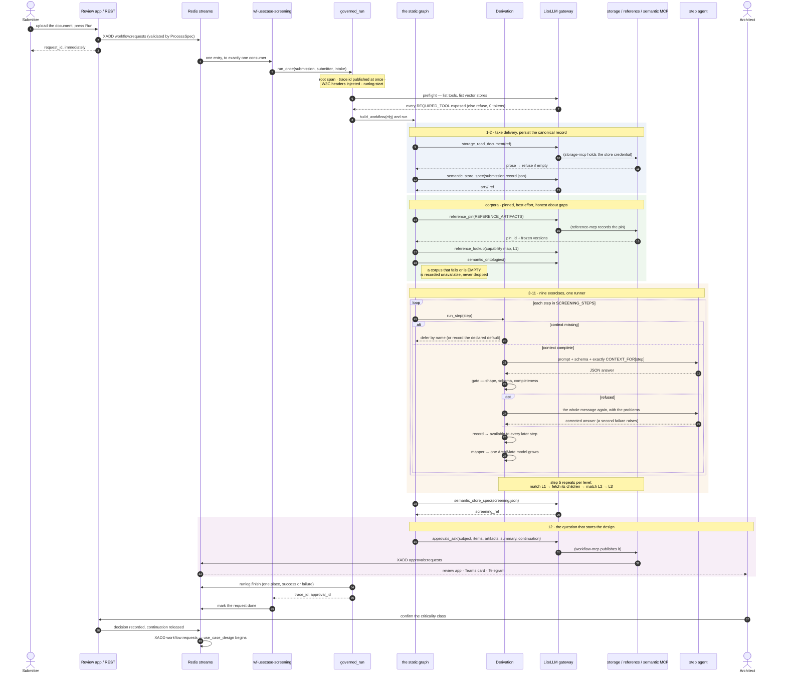

# A source walkthrough: `use_case_screening`, and the agent inside it

One business process, followed from the Redis entry that starts it to the question a human answers,
with every file named and every claim anchored to a line. The agent chosen for the deep dive is
**step 5, the capability match**, because it is the only one that runs more than once and the only
one whose strategy is a configuration choice.

Read `CLAUDE.md` first for why the lab is shaped this way. This document is the *how*.

---

## The shape, in one paragraph

A submission arrives as a durable stream event. A long-lived consumer picks it up, a composition
root builds the identity and the nine agents, and a shared skeleton opens one trace and one run-log
entry around a **static** Agent Framework graph. The graph reads the document through the governed
store, pins the reference corpora, runs nine exercises through one runner that gates every answer,
grows one ArchiMate model as it goes, and ends by asking an architect to confirm the criticality
class. Approving that question is what starts the design run; this one is already finished.



Reading it: everything above the last two lines is one run of five to twenty minutes, and it ends at
a question rather than an answer. The design half starts days later if it starts at all, which is why
approving releases a **continuation** rather than this consumer waiting.

---

## 1 · The entry point is a stream, not a call

`src/lab/workloads/use_case_screening/consumer.py` is thirty lines and deliberately dull. It names
what THIS process's inputs are called and hands the rest to `lab.workloads.consumer.serve`:

```python
async def _run(root, req, on_trace):
    return await run_once(root, req.inputs.get("submission", ""), ...)
```

Everything generic — the consumer group, crash hygiene for a request a previous process took and
never acked, SIGTERM handling, the one place a run is marked failed — lives in the shared `serve`.
A run takes five to twenty minutes, so submitting is enqueue-and-acknowledge: no tool call ever
blocks on one.

`_describe` returns a reference, never the submitter. Logs are read by other people.

## 2 · The host is the composition root

`use_case_screening/host.py:59` — `run_once` is the only place in this workload that reads
configuration. It resolves the credential (an Entra JWT through MSAL, else the durable virtual key),
and builds one agent per step:

```python
agents=A.build_all(SCREENING_STEPS, credential_for=_credential_for,
                   gateway_url=config.GATEWAY_URL, model=config.USECASE_AGENT_MODEL,
                   headers=c.traceparent)
```

`_credential_for` (`host.py:37`) is the seam that makes ten identities a configuration change: today
it returns the workload's credential for every bounded context, and when the per-agent Entra
registrations land it returns theirs. Nothing in the graph changes.

Span attributes are set here too, and they are counts and shapes only — `host.py:71` records *that*
a submitter was supplied, never who, because the collector is public.

## 3 · `governed_run` — the skeleton every host shares

`src/lab/workloads/run.py:46`. Six things happen in a fixed order, and the comments explain why each
was paid for:

1. open the root span, and publish the trace id **as soon as it exists** — a 600-second run is
   watched live, not after;
2. `propagate.inject` the W3C headers, so gateway and MCP spans join THIS trace;
3. build a `RunContext` (`run.py:27`) carrying the trace, the run id, the tracer and the MCP url;
4. `runlog.start` with an explicit `process` — it used to default to one workload's name, and the
   host that forgot to override filed its rows under somebody else's process;
5. run the graph;
6. close the run in exactly ONE place, `runlog.finish_from`, success or failure, then re-raise.

## 4 · The graph is static

`use_case_screening/workflow.py:201`. Five executors in a chain, no model chooses the next node.

| Executor | Line | What it does, and the trap it avoids |
|---|---|---|
| `receive` | `:205` | Enforces the one input rule `ProcessSpec.validate` cannot express: exactly one of an `art://` reference or a `collab://` handle. A handle is fetched into the store first. |
| `validate_and_persist` | `:225` | Reads the document through the governed store, refuses empty prose, persists the canonical record via `semantic_store_spec` and keeps the ref. The workload holds no store credential. |
| `corpora` | `:252` | Pins the reference artifacts, fetches what the exercises read. Every failure is RECORDED, and an empty corpus counts as unavailable — a step handed an empty capability map answers from nothing and looks grounded. |
| `derive` | `:302` | The nine exercises, each gated, each mapped onto the model. |
| `ask_criticality` | `:360` | Publishes the approval with the artifacts, the summary of what is open, and the continuation that starts the design run. Terminal. |

`make_cfg` (`:138`) is the one config contract: headers, MCP url, gateway url, agents, tracer, run
id. Nothing below it reads the environment.

## 5 · One runner, one invariant

`src/lab/workloads/usecase/derivation.py`. Three dictionaries — `available`, `derived`, `pending` —
and one line that justifies the class (`:47`):

```python
def record(self, key, out, number=""):
    self.derived[key] = self.available[key] = out
```

A derived output is immediately readable by the steps after it. That used to be two lines at every
call site plus a manual `available |= derived` re-sync between halves, which is a habit, not an
invariant.

`run_step` (`:64`) then, in order:

- no agent wired → return, leaving whatever deferred it standing;
- `needs = CONTEXT_FOR[step] - pool` → **defer by name**, unless the single missing thing is a corpus
  this tenant never published, in which case record the declared default (`fallbacks`) and list it
  under `defaulted_steps`;
- show the agent exactly `context_for(step, pool)`, and hand the SAME context to the completeness
  rule — a gate may only judge what the agent could see;
- `run_gated`, then `record`.

`package()` (`:117`) puts `pending_steps` first, because it is what a reader must not miss.

## 6 · What an agent actually is

`src/lab/workloads/usecase/agents.py`.

- `CONTEXT_FOR` (`:33`) — what each step may read, and nothing else. A context carrying everything
  would make every prompt a search problem and every wrong answer unattributable.
- `instructions` (`:92`) — the step's markdown prompt with the JSON schema appended **verbatim**, so
  the model reads the exact document the gate validates against rather than a description of it.
- `make_agent` (`:102`) — `AsyncOpenAI` against the gateway's `/v1/`, the workload's own credential,
  `store=False` forcing the stateless turn (the upstream implements only the non-stateful
  `/v1/responses`).
- `message` (`:120`) — the context as JSON, not prose: every value was produced by an earlier step
  against a schema, and re-narrating it invites reinterpretation of what a gate already accepted.
- `build_all` (`:132`) — nine steps, six services. Steps 3 and 10 are both the Business Analyst;
  they are separate agents because each has its own prompt and schema, but they authenticate as one
  identity, because the bounded context is what owns a corpus and answers for an answer.

## 7 · The deep dive: step 5, the capability match

This is the only step that runs more than once, and the only one whose behaviour is a strategy.

**The workload supplies the seams; the strategy decides how to use them.**
`workflow.py:174` builds two closures and hands them over:

```python
async def children(ids, level):   # rows by parent, under this run's pin, attributed to this field
async def search(query, k):       # the vector store through the gateway, under the same pin
return await coverage.match(cfg, d, d.available.get("capabilities") or [],
                            name=config.COVERAGE_MATCHER, children=children, search=search, ...)
```

Which artifact a run reads, and that it reads it under a pin attributed to a field, is the
workload's decision. *How* the map is matched is not.

**The registry is one line per strategy** (`coverage.py:325`):

```python
MATCHERS = {"drill": drill, "leaves": leaves, "vector": vector}
```

**`resolve` (`:328`) is arithmetic, not preference.** `leaves` is the better matcher, but its
candidate set grows with the map; if the leaves would not fit the prompt budget it falls back to
`drill`, whose candidate set does not grow, because no single LEVEL of a tree is large.

**`drill` (`:169`)** walks level by level: which L1 capabilities the use case touches, then which L2
within those, then L3. Two decisions worth reading:

- *Every level is kept in a trail.* A final L3 list alone cannot be checked — a leaf under a branch
  nobody should have opened looks exactly like a leaf under one they should.
- *A gate failure defers rather than raises.* A deeper pass is more likely to fail, and losing the
  run would throw away every level that already passed plus every other step in a 700-second run.
  The `d.record("coverage_map", composed(trail))` at the end deliberately passes **no step number**,
  because that would clear the pending marker the failure branch just wrote.

**The gate itself** is `steps._coverage_map` (`steps.py:171`): both directions of coverage must be
reported, a capability id must be one the step was actually shown (a reasoning model substitutes the
human-readable label for the key, measured nine times out of nine), the heat-map position must name
its source, a TRUE heat position needs a column to have been read from, and a map in which nothing
is a `lookup` must say so.

**One retry, then it raises** — `gates.run_gated` (`gates.py:92`). The retry re-sends the ORIGINAL
message with the problems appended, because the client is stateless: a follow-up carrying only "you
missed X" would arrive with no X to fix.

## 8 · The model grows as it goes

After each step, `modelling.grow` runs that step's deterministic mapper
(`usecase/mappers.py`) onto one ArchiMate model: ids are a pure function of the output, every
relation is checked against the published matrix at proposal, and an illegal one is counted rather
than raised — a mapper is bookkeeping and must not fail a twenty-minute run. The model rides the
record, so the design half continues it rather than starting again.

## 9 · It ends with a question

`ask_criticality` (`:360`) publishes one approval carrying: the artifacts a reviewer may open, the
summary of what the screening found and what it defaulted, and the **continuation** — the process to
start, its inputs, and which answer becomes an input. That is what lets approving start the design
run days later without pinning a consumer replica here.

---

## Running it, and watching it

```bash
set -a && source .env && set +a
.venv/bin/python -m lab.workloads.use_case_screening.host art://<id>/use-case.md you@example.com
```

Prints the trace id and the approval id. Then:

- **the trace** — `$JAEGER_UI_URL`, service `process-usecase-screening`, one trace spanning the
  workload, the gateway, and every MCP server it touched;
- **the run board** — the review app's Runs page, or `GET /api/runs/open`;
- **the record** — `screening.json` by the ref on the approval, carrying `pending_steps`,
  `defaulted_steps`, `corpora_unavailable`, the coverage trail and the model.

## Where to look next

| If you want to understand… | Read |
|---|---|
| Why a step defers instead of guessing | `usecase/derivation.py`, `usecase/fallbacks.py` |
| What a gate can refuse that a schema cannot | `usecase/steps.py` (the completeness rules) |
| How the three matchers compare | `usecase/coverage.py` + `scripts/eval_coverage.py` + `docs/evals/coverage-baseline.json` |
| How an output becomes architecture | `usecase/mappers.py`, `usecase/model.py` |
| What the design half does with all this | `use_case_design/workflow.py` |
